# L'Association — Qui sommes-nous ?

> Source originale : [https://www.perouamitiesolidarite.org/qui-sommes-nous/](https://www.perouamitiesolidarite.org/qui-sommes-nous/)

---

L’association Pérou Amitié Solidarité est une organisation non gouvernementale à caractère humanitaire. Elle a été créée en 2003 par Ysabel Paire-Ficout, Péruvienne arrivée en France dans les années 80 . Son siège se trouve en Gironde plus précisément à Baurech.  Elle a pour but de subvenir aux besoins essentiels des enfants défavorisés du Pérou au nord de Lima et de les aider à se construire un avenir meilleur par le biais de l’éducation et de participer au développement du Collège Miguel Grau sur l’île d’Amantani.

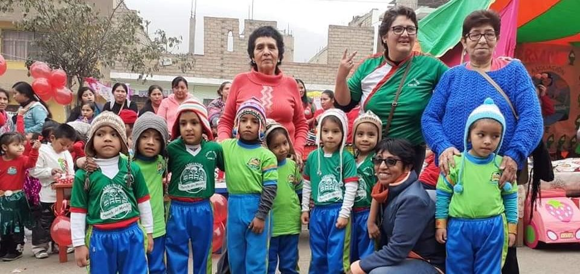

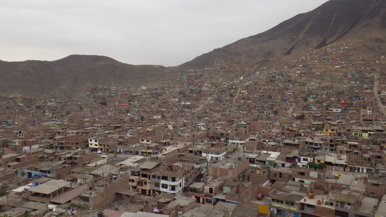

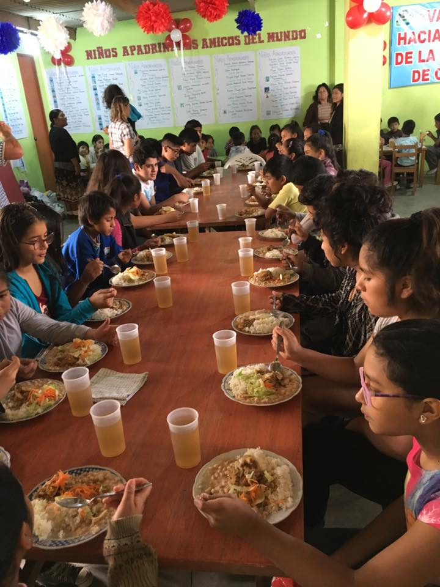

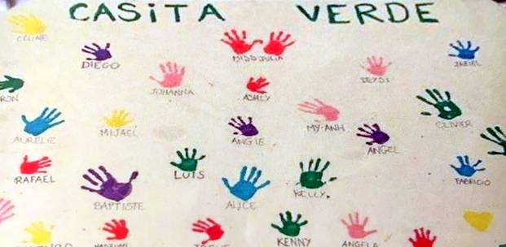

## Donnons-leur la main pour les aider à avancer dans la vie ….

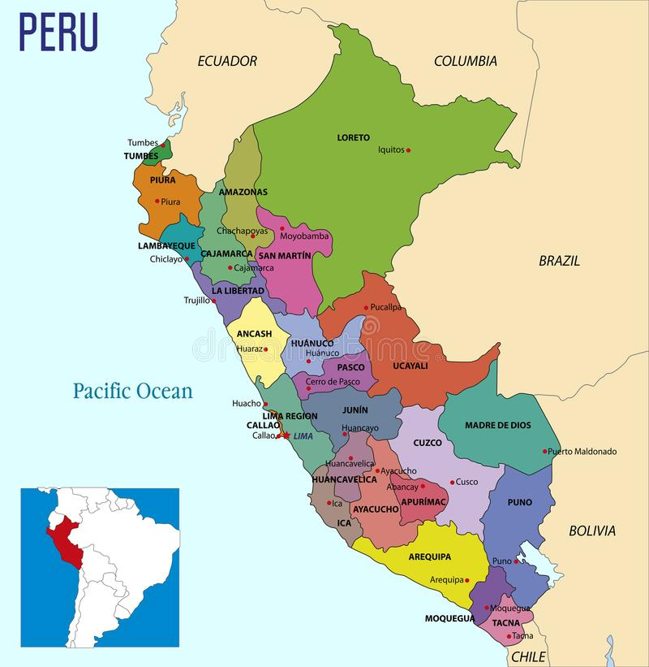

Nous sommes présents dans deux régions du Pérou :

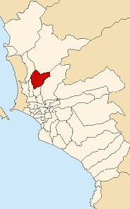

À COLLIQUE, bidonville au nord-est de LIMA, capitale du Pérou.

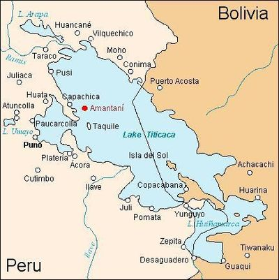

et dans l’île d’Amantani sur le lac Titicaca, Puno ,

Notre objectif est de protéger et d’offrir de meilleures conditions de vie aux enfants du bidonville de COLLIQUE, de les accompagner aussi dans leur scolarité grâce à un suivi pédagogique main dans la main avec les institutrices. Nous les accompagnons après le collège dans leur éducation supérieure s’ils le souhaitent. C’est à travers l’éducation que nous pourrons leur donner l’opportunité de sortir de la pauvreté et leur assurer un avenir meilleur. Depuis 2011 nous menons des actions aussi dans l’île d’AMANTANI.

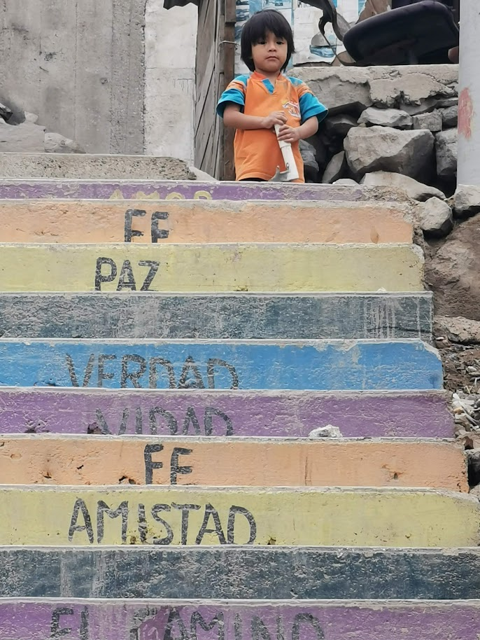

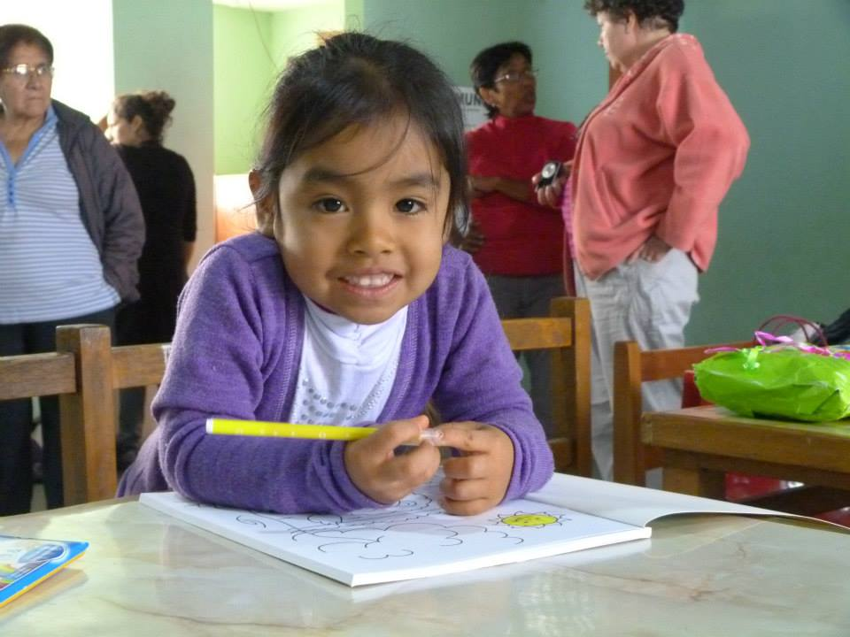

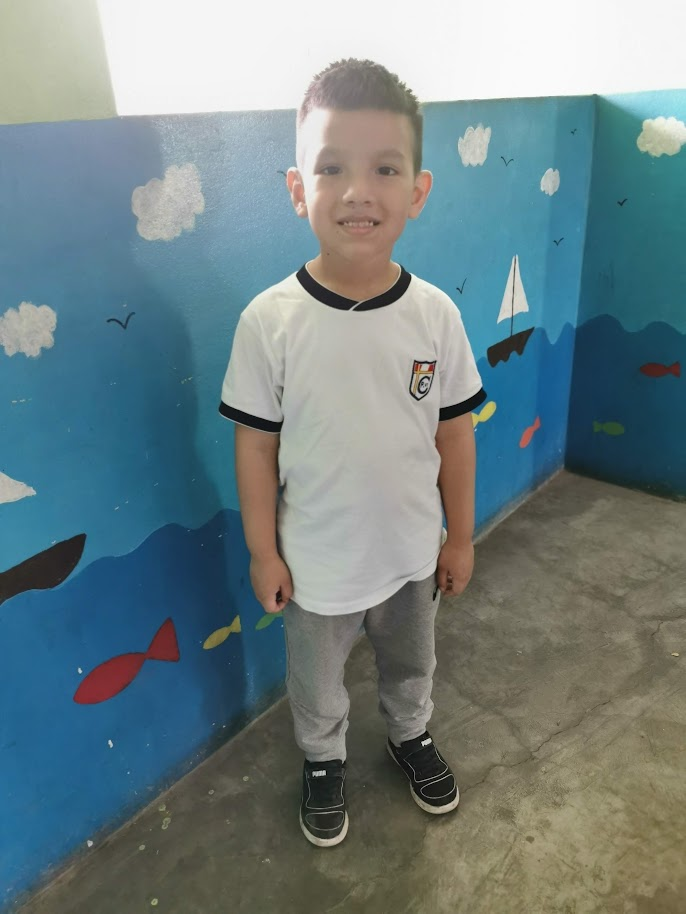

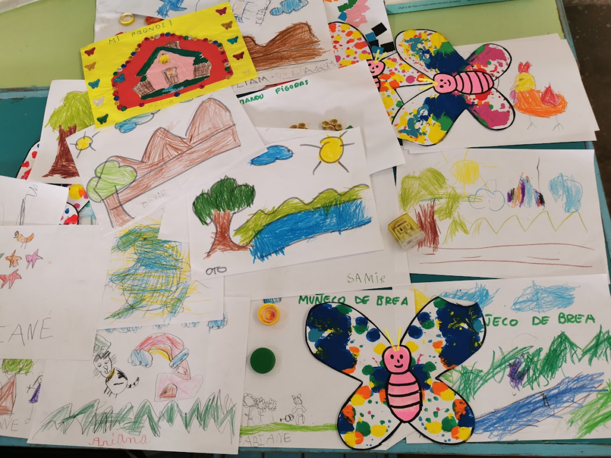

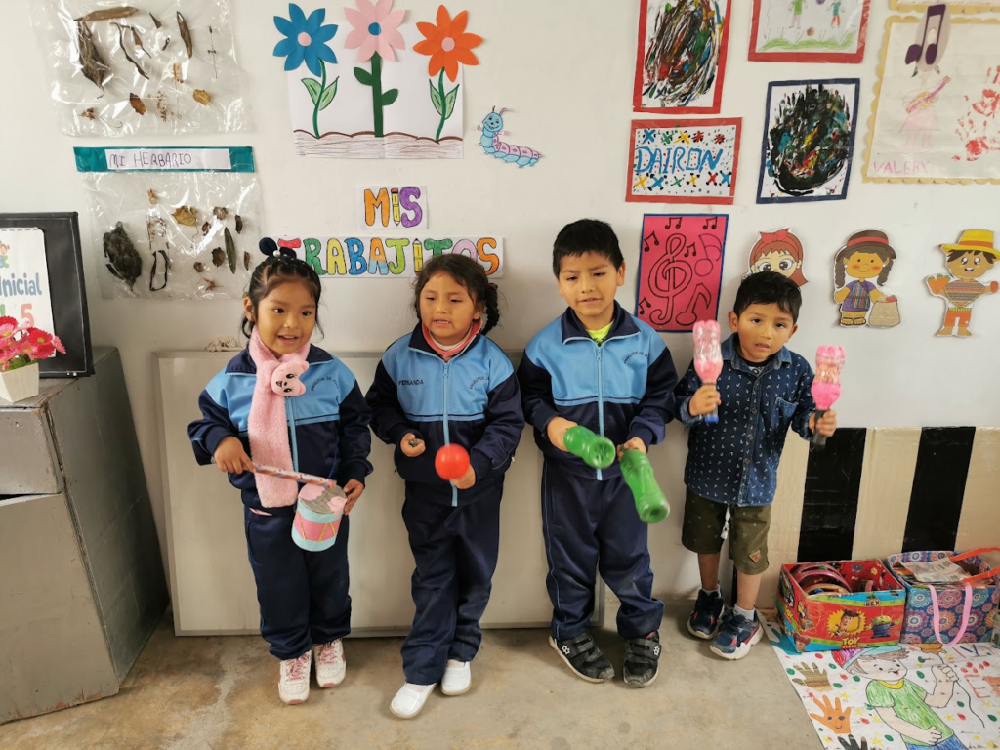

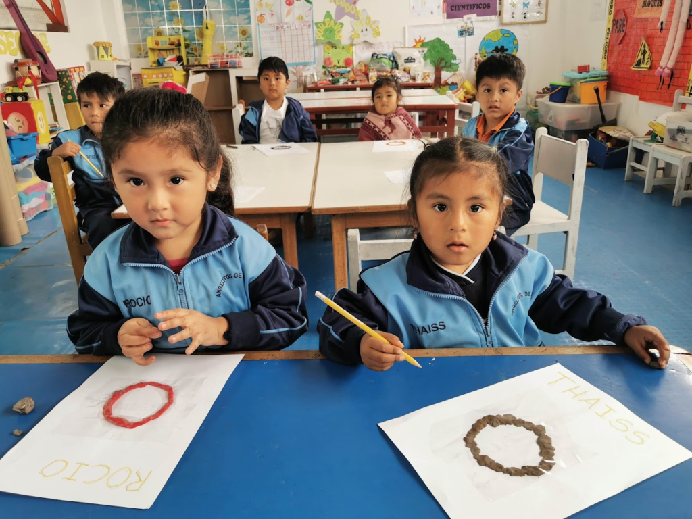

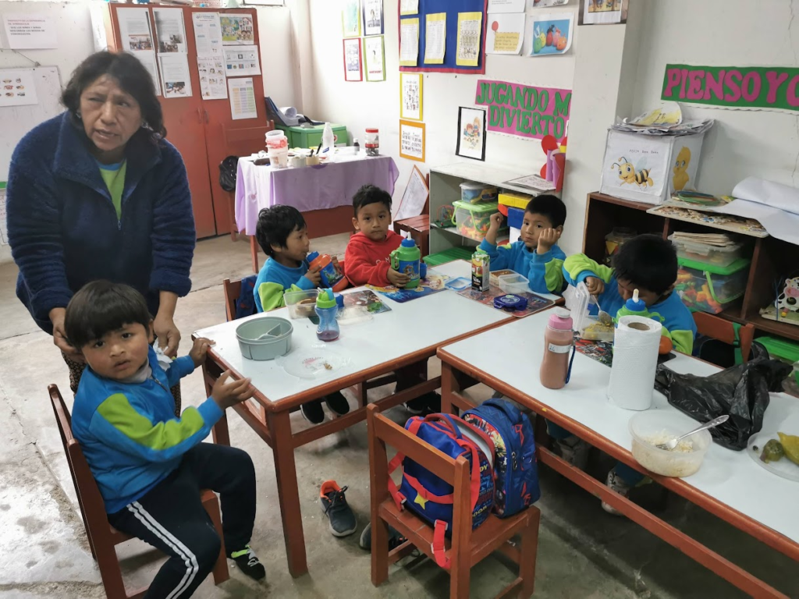

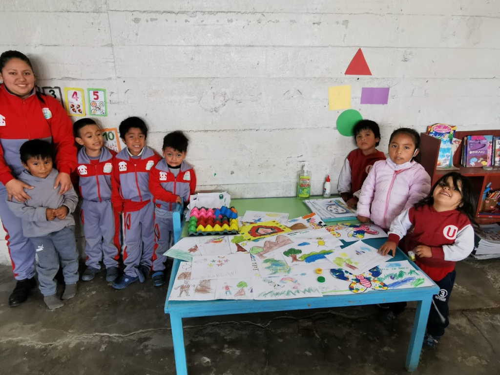

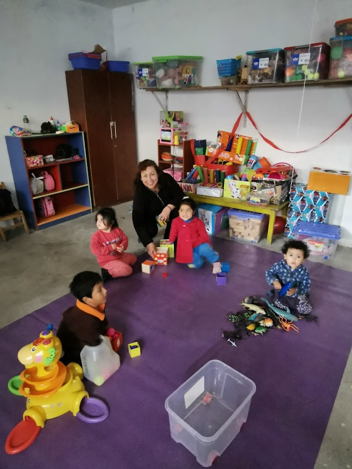

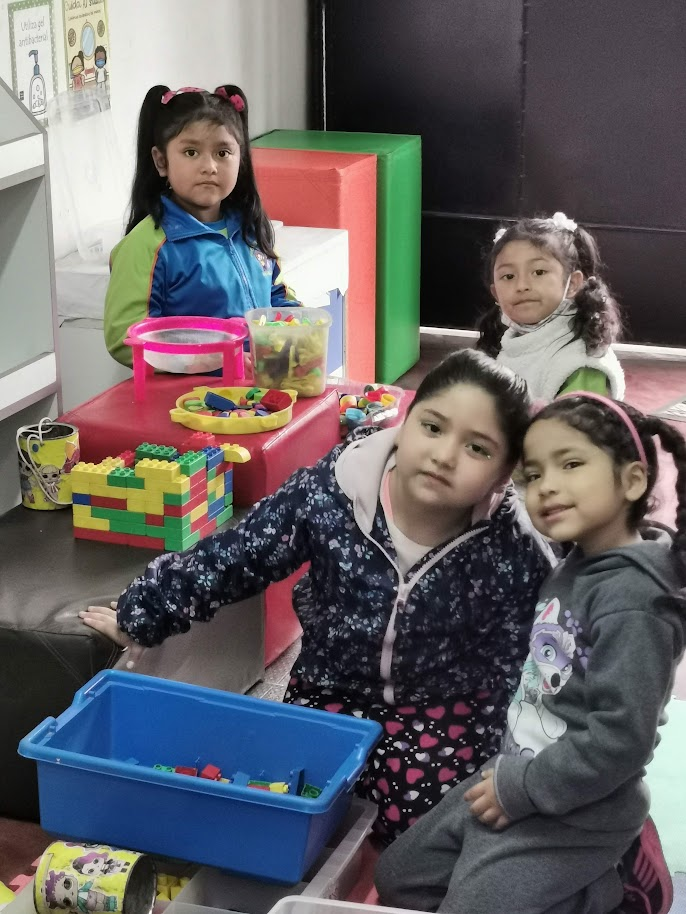

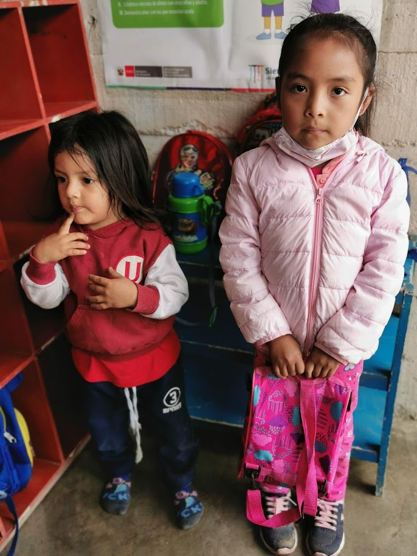
