# Benevolat et Stage

> Source originale : [https://www.perouamitiesolidarite.org/benevolat/](https://www.perouamitiesolidarite.org/benevolat/)

---

## Rejoignez-nous pour vivre une expérience humaine inoubliable

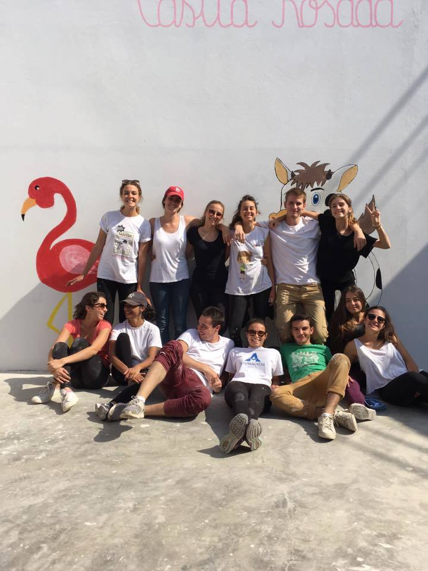

Chaque année de nombreux jeunes et moins jeunes se rendent à Collique pour donner de leur temps et de leur savoir-faire afin d’améliorer le quotidien des enfants. Ils participent aux rénovations, aux constructions et aussi aux ateliers avec les enfants et à la préparation des repas.

En fonction de leurs compétences, ils animent des ateliers sur la Santé, (hygiène, sexualité, vaccination).

Pérou Amitié Solidarité peut vous permettre de réaliser un stage dans le cadre de vos études

-Soit à Collique,  en vous mettant en contact avec notre association partenaire Puente del Mundo qui sera votre maitre de stage.

-Soit à Amantani, votre maitre de stage sera :  Ysabel Paire Ficout.

Si vous êtes intéressé par le bénévolat ou le stage, contactez Ysabel Paire Ficout qui sera votre interlocutrice privilégiée. Elle organisera notamment votre hébergement sur Collique et Amantani chez l’habitant.

Notre association ne demande que l’adhésion pour pouvoir bénéficier de ces contacts. Le séjour est à votre charge financièrement.

La plupart des participants finance leur séjour en organisant des actions l’année précédente et arrive les bras chargés de matériel ou  participe financièrement à la réalisation de certains projets.

Les enfants sont ravis de voir arriver tous ces jeunes gens;.

REJOIGNEZ-NOUS !  Ensemble, nous pourrons rendre leur vie meilleure

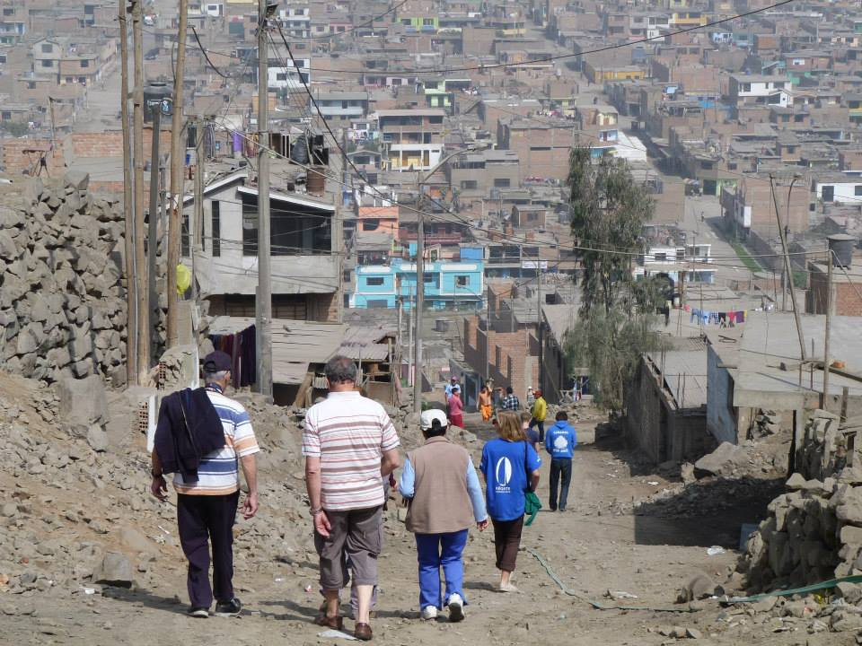

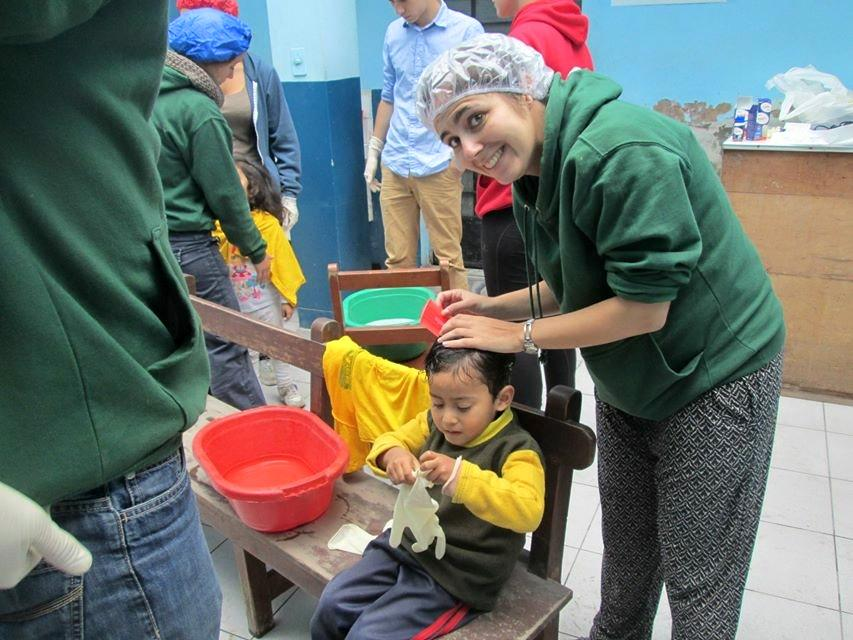

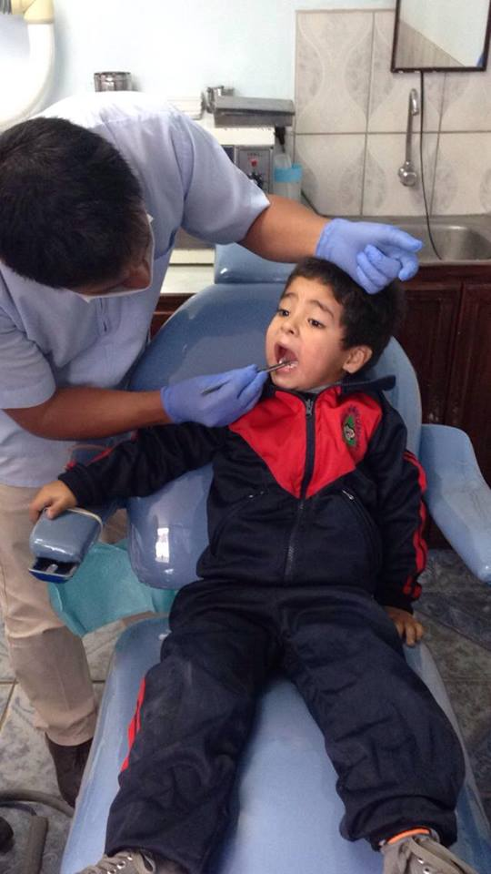

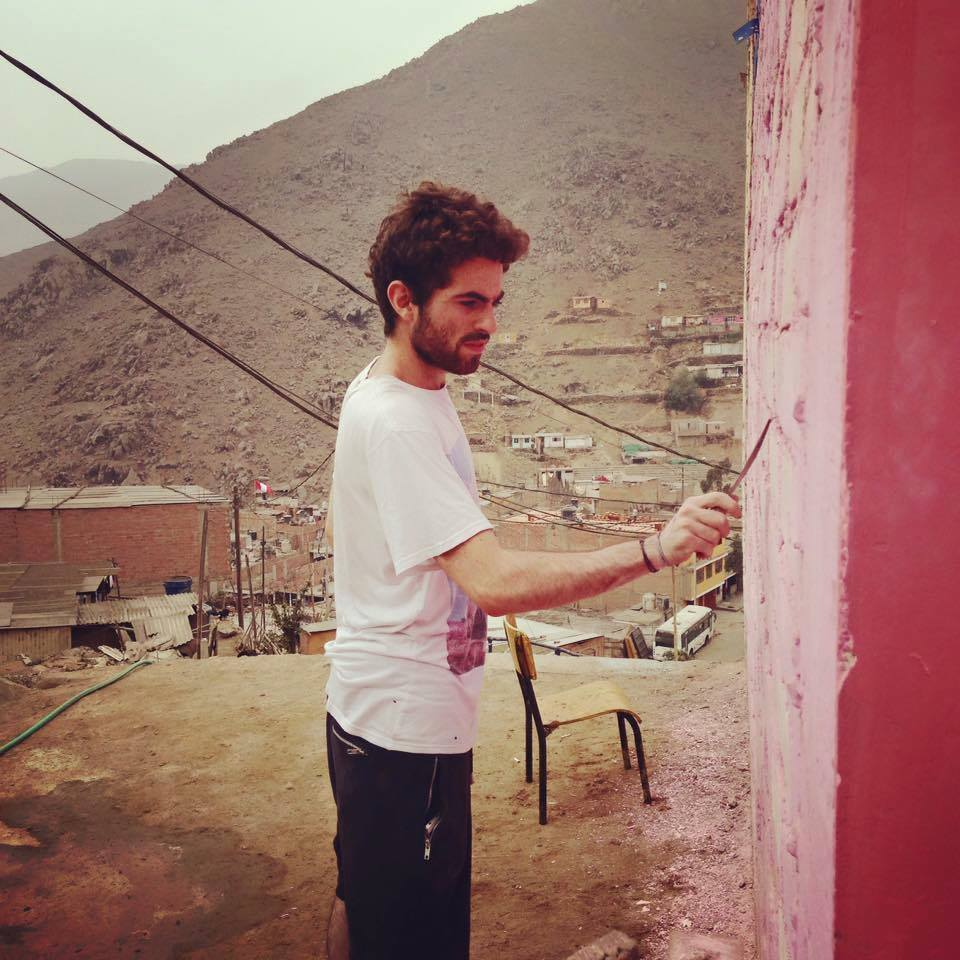

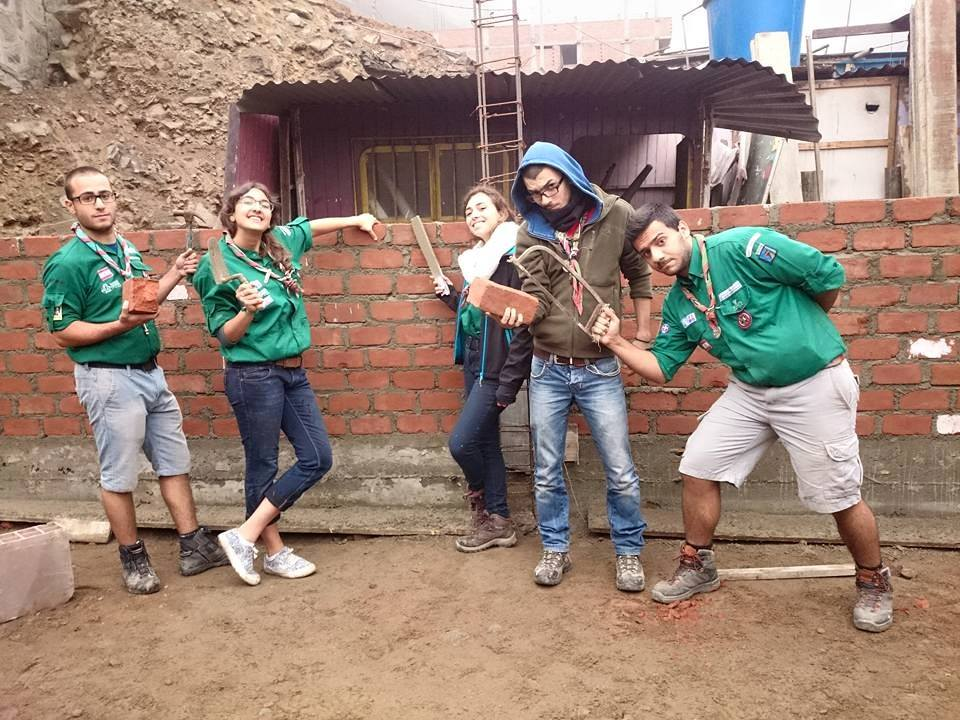

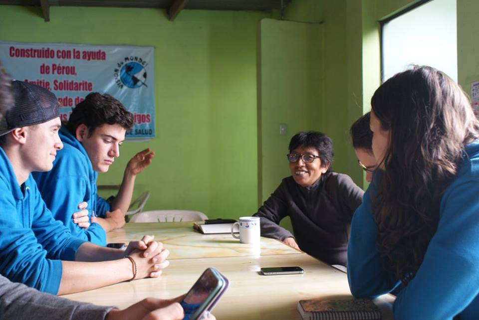

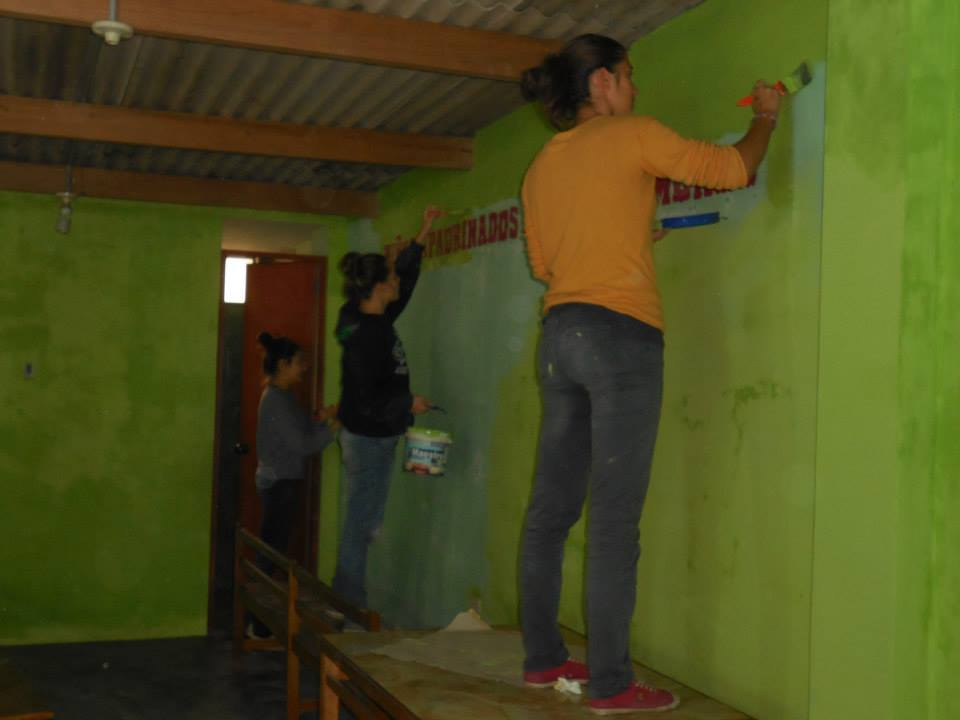

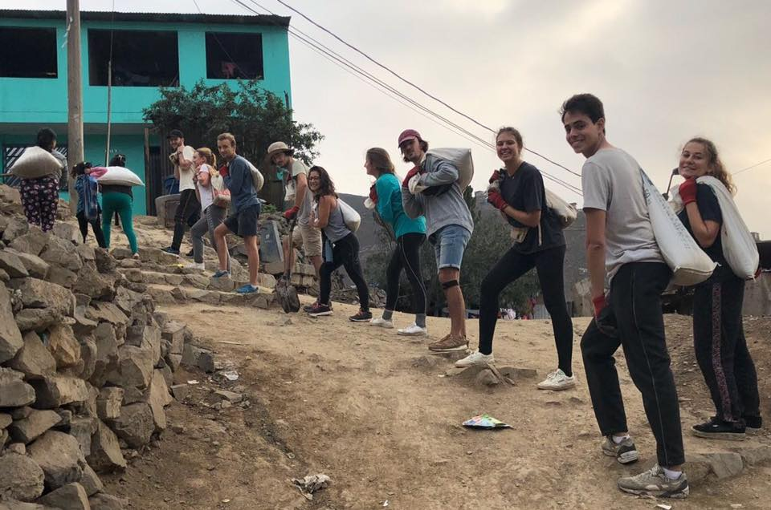

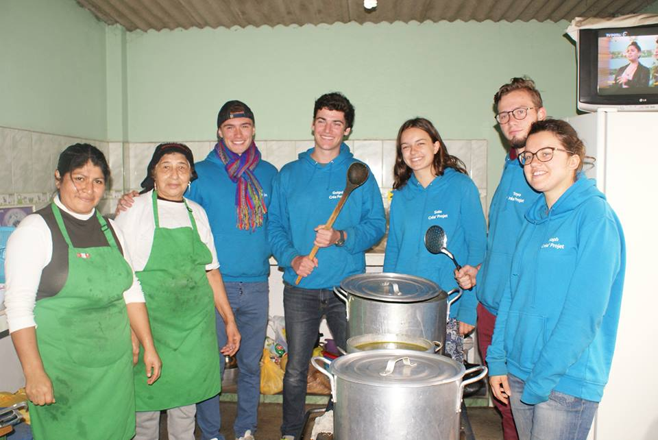

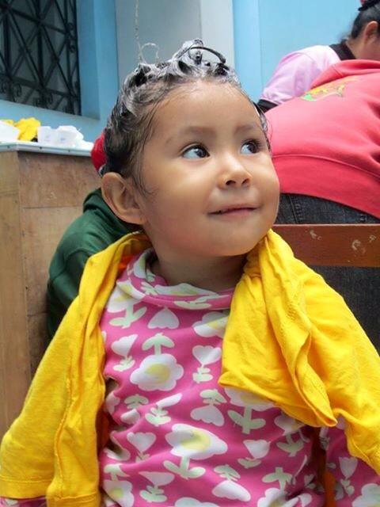

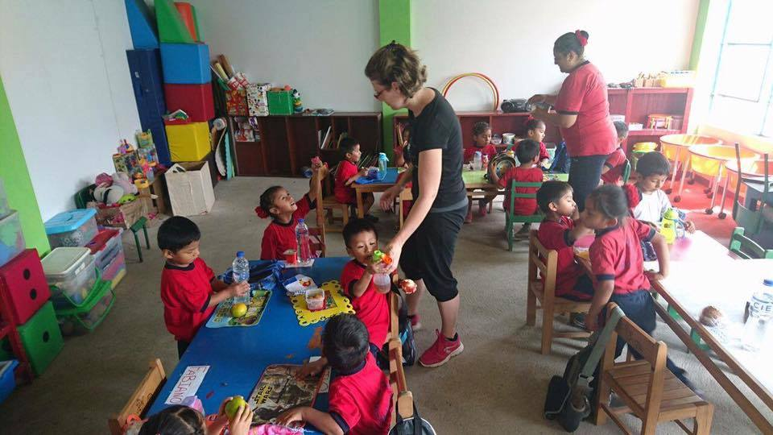
