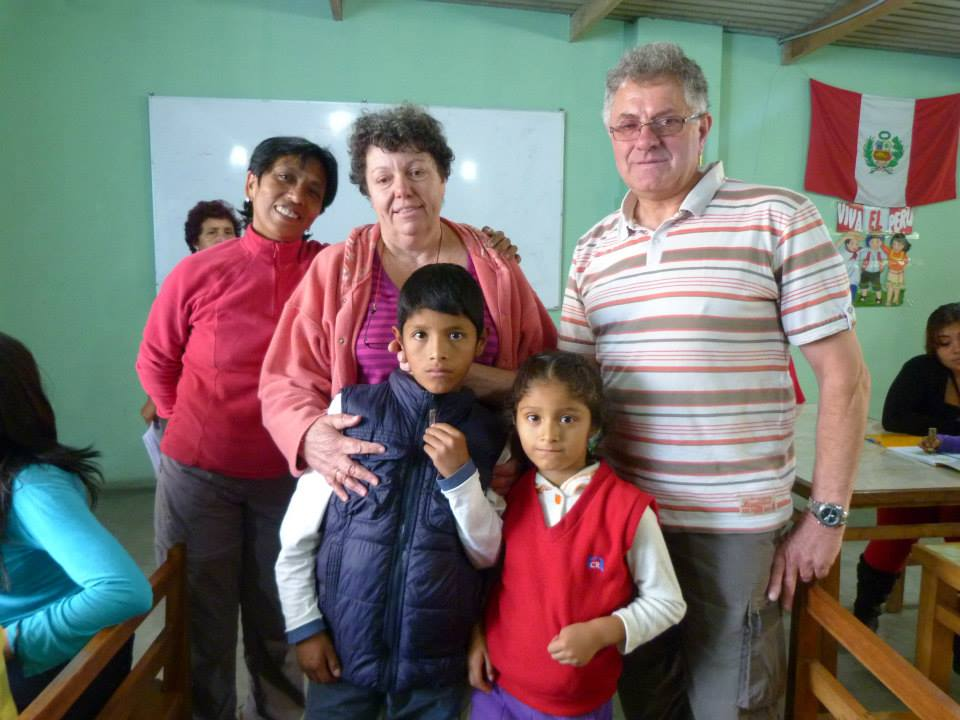
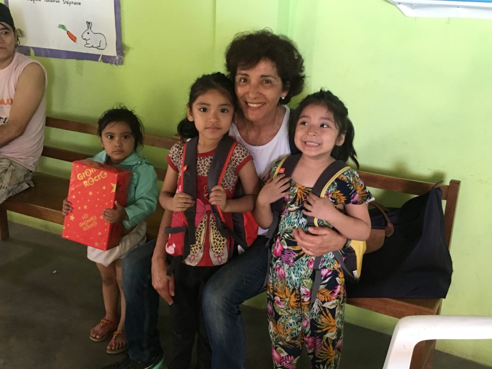
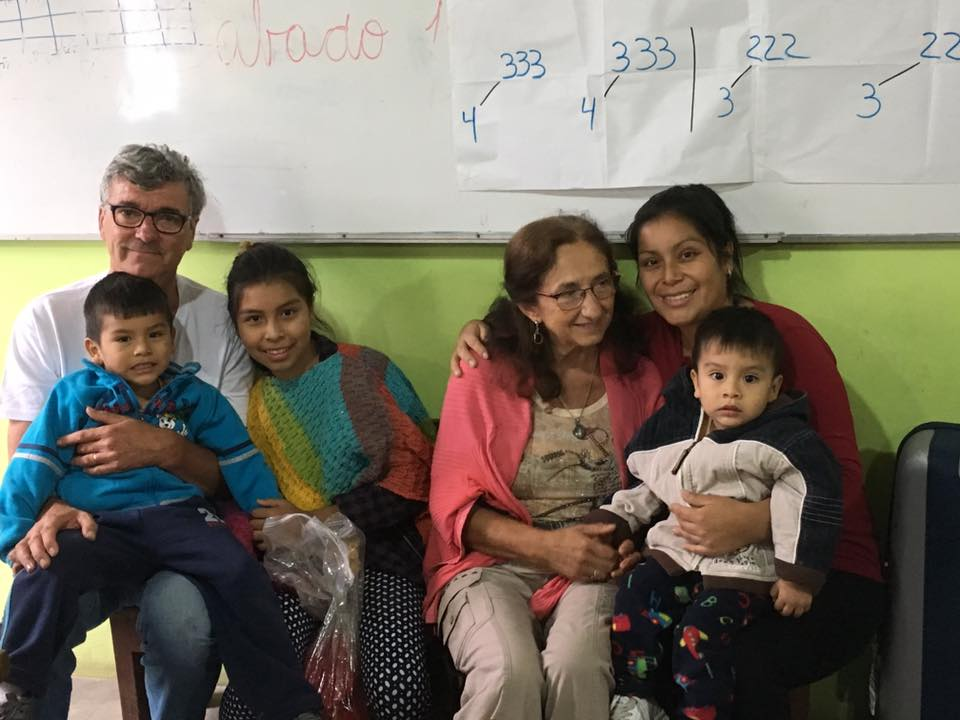
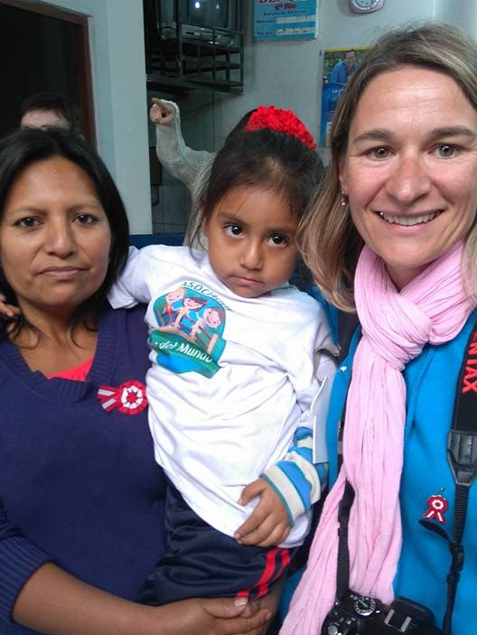
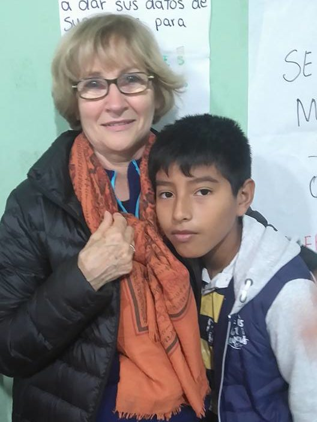
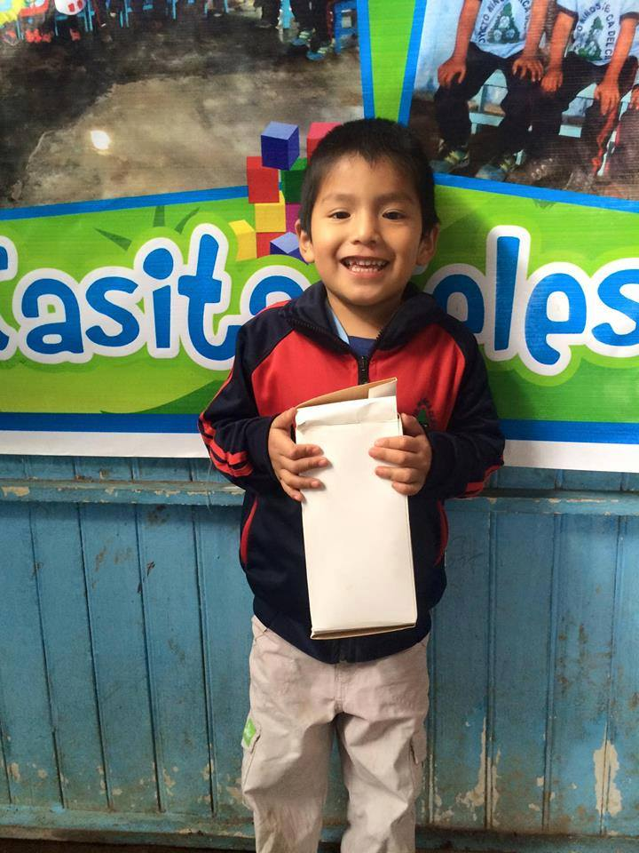

# Comment devenir parrain ou marraine ?

> Source originale : [https://www.perouamitiesolidarite.org/comment-devenir-parrain-ou-marraine/](https://www.perouamitiesolidarite.org/comment-devenir-parrain-ou-marraine/)

---

Il vous faut tout d’abord adhérer à l’Association Pérou Amitié Solidarité puis remplir un bulletin de parrainage et nous le faire parvenir. Dans les jours qui suivront la réception de votre dossier, nous vous enverrons une proposition de parrainage avec les coordonnées de votre filleul (e) et de sa famille. Le parrainage démarrera avec votre accord au premier jour du mois qui suivra le premier versement. Vous pourrez, dès lors, correspondre avec votre filleul (e ) et sa famille selon les modalités indiquées dans un courrier qui vous aura été adressé.

Un parrain ou une marraine par le biais de l’association, apporte un soutien économique à son filleul (e) pour une année minimum, renouvelable à chaque date anniversaire. L’association s’engage à maintenir les parrains et les marraines, informés sur la scolarité, le suivi et le développement de leur filleul (e).

Changez la vie d’un enfant pour 0,80€ par jour

## Note Importante

## A la rencontre de votre filleul/e:

Devenir parrain c’est également faire un pas pour mieux connaitre le Pérou, un pays fascinant mais aussi rempli de difficultés, tout en donnant à un enfant qui habite une zone défavorisée, l’accès à une vie meilleure.

Pratiquement la totalité de nos 130 parrains de l’association sont français et plusieurs ont déjà eu l’opportunité de se rendre sur place pour rencontrer et suivre leur filleul.

Si un jour vous souhaitez rendre visite à votre filleul (e) dans son pays, nous vous aiderons à organiser votre voyage et votre lieu d’accueil.
