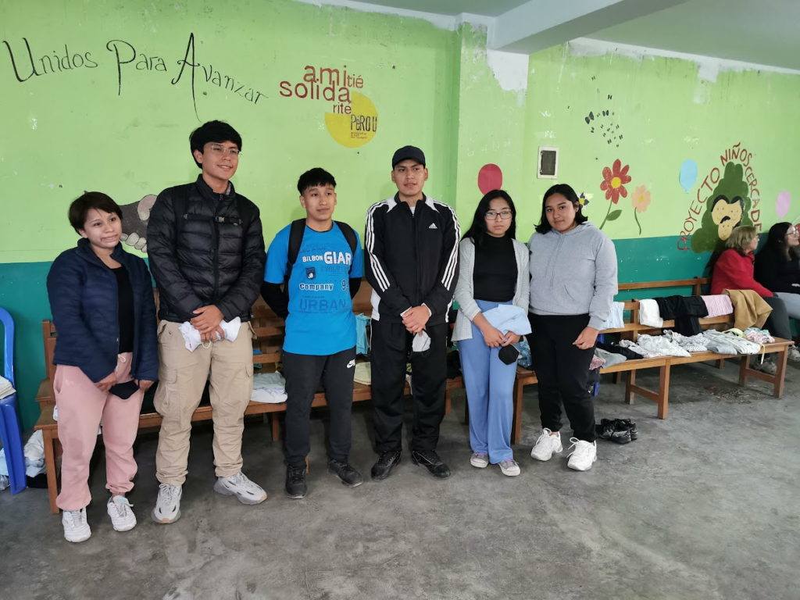
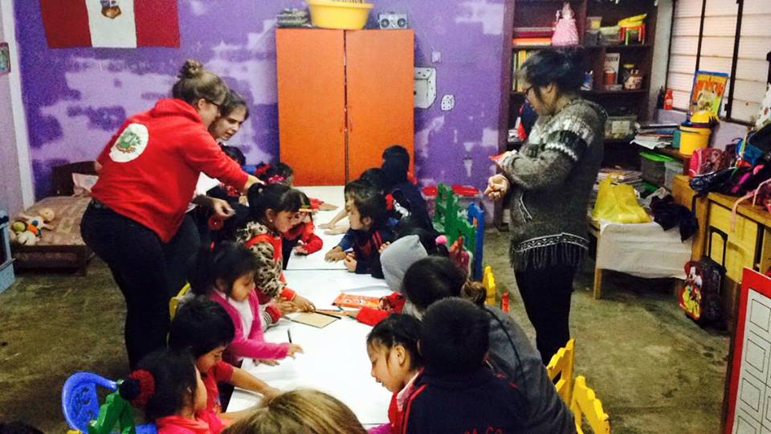
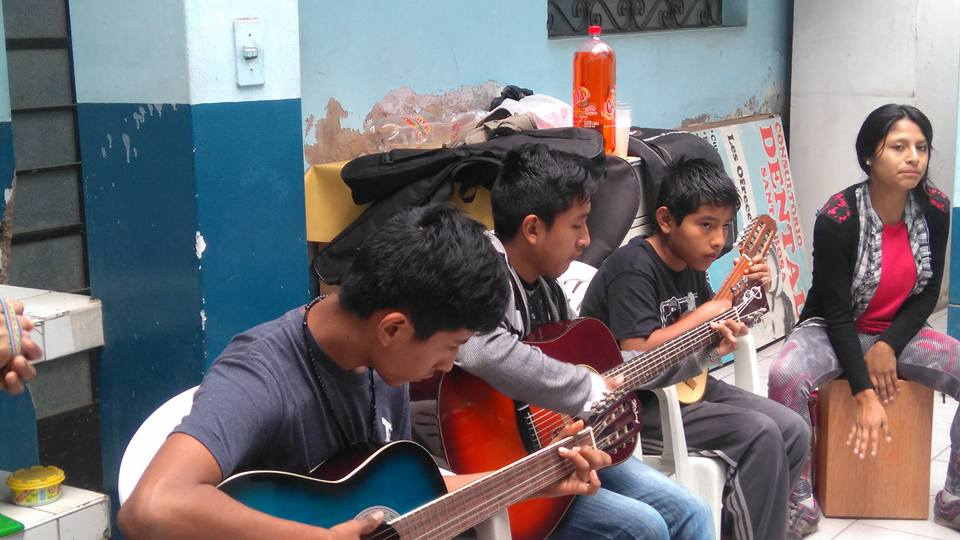
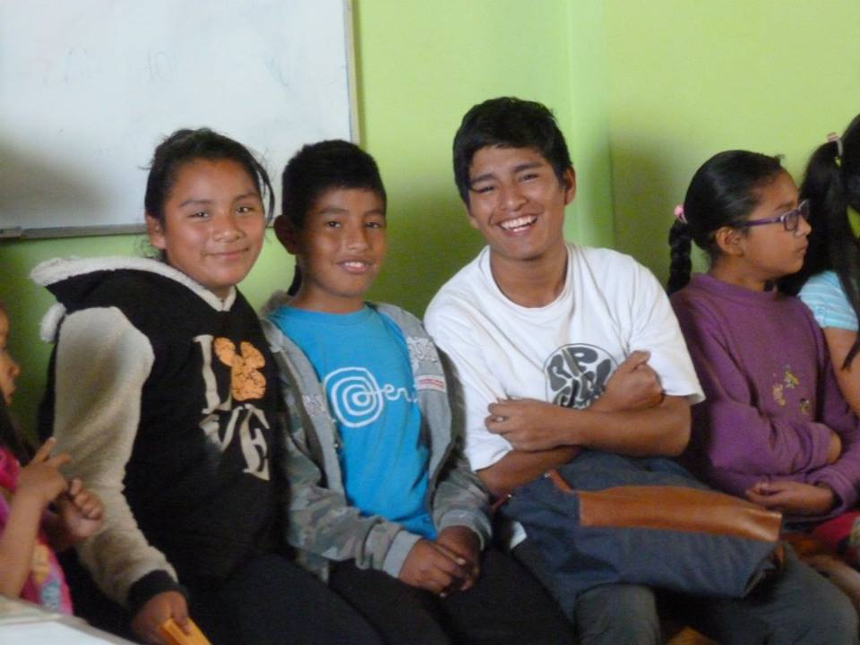
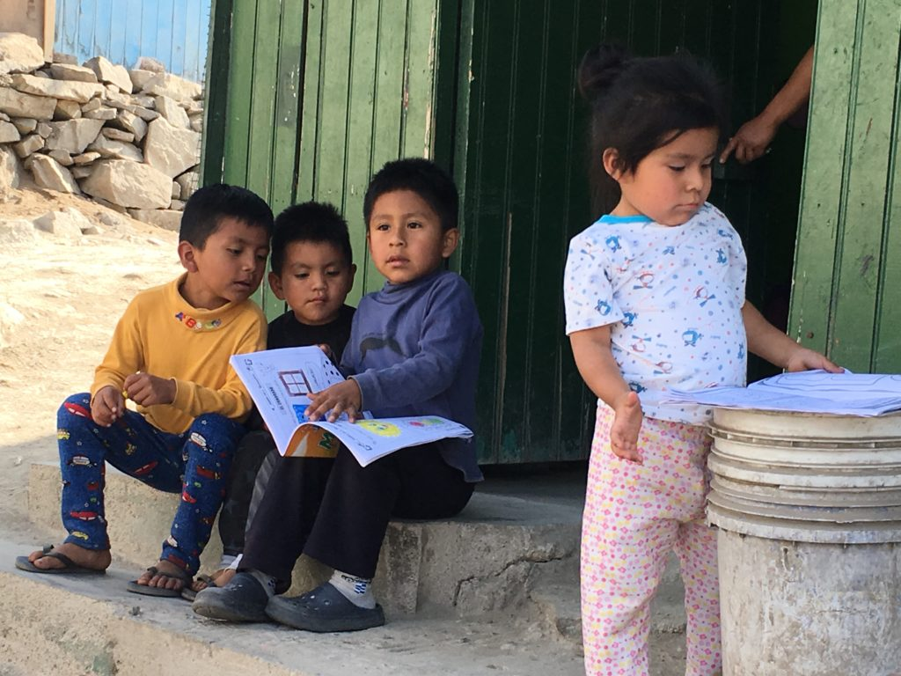

# Parrainage Etudes - A partir de 35 euros

> Source originale : [https://www.perouamitiesolidarite.org/etudes/](https://www.perouamitiesolidarite.org/etudes/)

---

## COMMENT CA MARCHE ?

Depuis 2018 nous avons mis en place des parrainages études pour les enfants qui finissent leur scolarité obligatoire. L’équipe sur place les accompagne dans leur orientation afin qu’ils puissent obtenir un diplôme et trouver un emploi par la suite.

Parrainer un jeune qui quitte le colegio (l’école obligatoire), c’est l’accompagner vers l’autonomie. Au Pérou, il existe deux voies possibles pour poursuivre ses études :

- La première à l’Instituto en 3 années qui permet d’acquérir un diplôme professionnalisant et aussi d’accéder par équivalence à l’université à l’issue de ces trois années.
- La seconde est l’université.

Dans les deux cas les adolescents doivent faire une prépa pour accéder à ces formations. Ils seront nombreux à partir dans la première voie pour avoir plus de chance d’entrer à l’université s’ils souhaitent continuer leurs études.

Chaque semestre, les étudiants s’engagent à nous montrer leur progression et surtout leur assiduité en cours.

Ce parrainage permet de payer l’année de scolarité, les transports, ainsi que le matériel scolaire.

