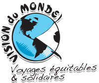
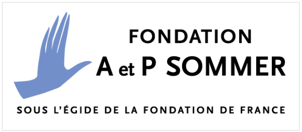
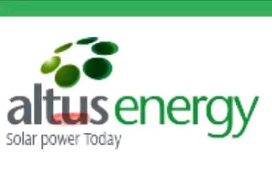

# Nos Partenaires

> Source originale : [https://www.perouamitiesolidarite.org/nos-partenaires/](https://www.perouamitiesolidarite.org/nos-partenaires/)

---

## Merci à nos partenaires :

Vision du Monde est notre principal partenaire depuis le début. Cette agence de voyages solidaires reverse des fonds pour porter des projets dans différents pays dont le Pérou. Ils ont permis la construction du mur antisismique de la cour de récréation de la Casita  Rosada à Collique et une partie de la réalisation du projet « De l’eau pour Amantani ». http://www.visiondumonde.org/

FONDATION DE DOTATION JEAN MERLAUT

La Fondation de Dotation Jean Merlaut participe régulièrement à nos diverses actions.

La Fondation Adrienne et Pierre Sommer, a participé au projet « De l’eau pour Amantani » et a permis sa réalisation.

https://fondation-apsommer.org

L’imprimerie Belloc nous imprime gracieusement notre journal annuel.

IMPRIMERIE BELLOC : https://belloc-imprimeur.com/

ALTUS ENERGIE société d’installation de panneaux photovoltaïques
