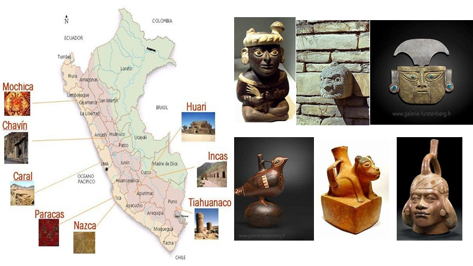
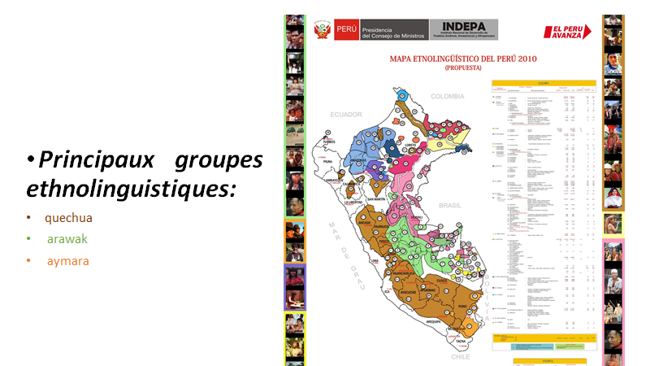
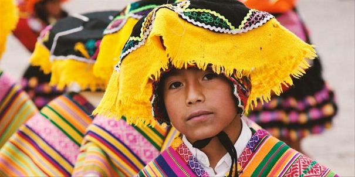
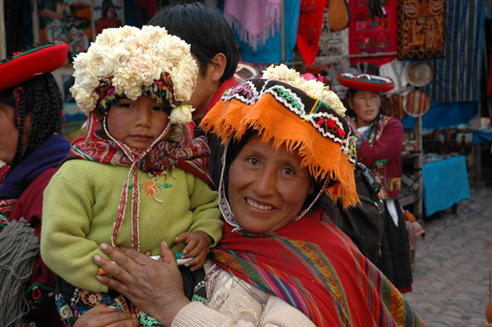
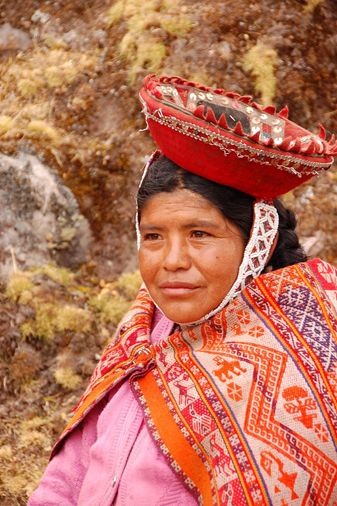
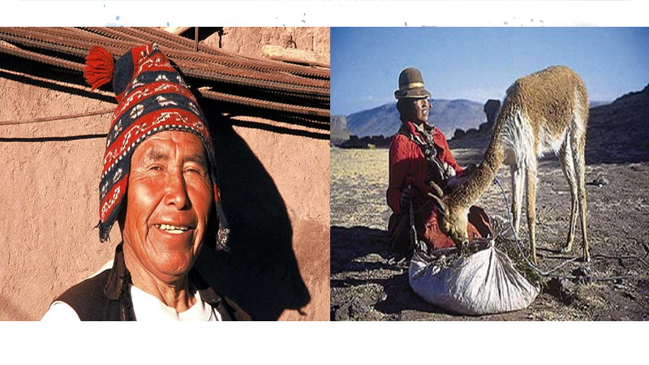
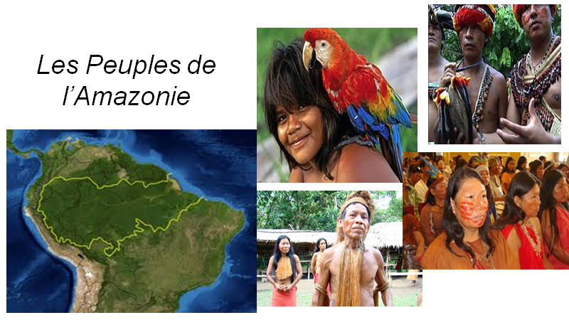
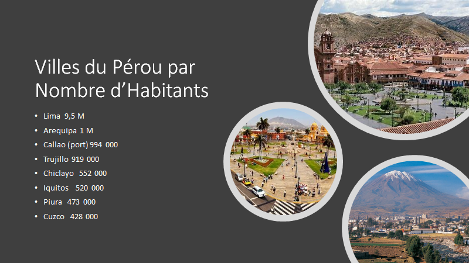
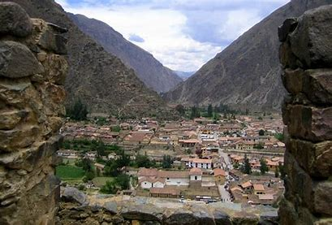

# Le Perou - Demographie et Langues

> Source originale : [https://www.perouamitiesolidarite.org/demographie-langues/](https://www.perouamitiesolidarite.org/demographie-langues/)

---

# – Langues– Groupes Ethnolinguistiques– Villes importantes

### QUECHUAS

## Les Aymaras

