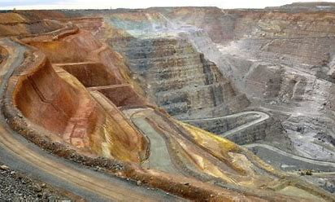
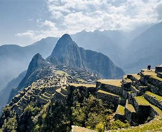

# Le Perou - Activites Economiques

> Source originale : [https://www.perouamitiesolidarite.org/activites-economiques/](https://www.perouamitiesolidarite.org/activites-economiques/)

---

## L’Exploitation minière

Le Pérou possède d’importantes richesses naturelles dans son sous-sol. Grand pays minier le Pérou est le premier producteur mondial d’argent, le 2ème de cuivre et de zinc, et le 5ème d’or.  Les mines d’or causent des destructions plus irréversibles que l’élevage ou l’abattage des arbres, même si elles occupent une moindre superficie. Non seulement les chercheurs d’or brûlent la forêt, mais ils érodent le sol, parfois sur quinze mètres de profondeur. Par ailleurs, ils polluent fleuves et rivières avec le mercure qui leur sert à amalgamer l’or.      Le Pérou est également un important fournisseur de plomb, de zinc, d’étain et de phosphates. Seulement 6 % du territoire du pays ayant un potentiel minier a été exploité. Le secteur minier représente 60 % des exportations. Les principales entreprises minières : Cía Minera Antamina, Sociedad Minera Cerro Verde, la Minera Las Bambas, Southern Perú, Cooper Corp, Trafigura Perú y Glencore. Aussi la Cía Minera Antapaccay, Votorantim Metais, Shougang Hierro Perú y Cía. de Minas Buenaventura y SUB.      Le Pérou possède également des ressources en gaz dans le bassin amazonien.

## La Pêche

Gros pays de pêche avec ses 3.000 kilomètres de côtes il extrait 9 millions de tonnes d’espèces variées par an. Il est le premier exportateur mondial de farine et d’huiles de poisson.    La pêche au Pérou est un secteur vital qui profite des eaux poissonneuses du Pacifique. Le Pérou est le second producteur mondial avec plus de 9,5 millions de tonnes par année. Il est devancé par la Chine et suivi par les États-Unis . À partir des années 1950, le Pérou a développé son industrie halieutique. À partir des années 1960, le pays fait partie des plus grands producteurs mondiaux des produits de la pêche. Dernièrement, le développement de la pêche a permis le développement du port de Chimbote.    Les produits marins suivants sont exploités :

- Anchoveta (famille des anchois). Nom scientifique : Engraulis ringens.

- Corvina (famille des Sciaenidae). Nom scientifique : Cilus gilberti.

- Lenguado (famille des Soleidae).

- Bonito

- Jurel

L’anchoveta est utilisée pour produire de la farine de poisson. Le Pérou est le plus grand producteur de farine de poisson au monde. Une grande partie de la pêche est destinée au marché interne (surtout les régions côtières) sous la forme de poissons frais et en conserve.

## L’ Agriculture

Le pays dispose d’un potentiel agricole intéressant grâce à la grande variété de ses climats et à l’irrigation des terres désertiques de la côte.  Presque 36% de la population active du Pérou se consacre aux activités agricoles. La plupart des terres de la côte (Costa) sont destinées à la culture de produits d’exportation, tandis que les produits pour la consommation interne proviennent des régions de la montagne et de la forêt. La plupart des propriétés agricoles sont assez petites et elles sont vouées à des cultures de subsistance, mais il existe aussi de grandes coopératives agricoles.

L’agriculture fournit principalement de la canne à sucre, du café, du coton, du riz, du blé, du maïs, de l’orge, mais aussi des fruits tropicaux et certains légumes. C’est notamment le premier exportateur mondial d’asperges.  Le Pérou est l’un des 5 plus grands producteurs d’ avocats, de myrtilles, d’ artichauts, l’un des 10 plus grands producteurs au monde de café et de cacao, et l’un des  15 plus grands producteurs au monde de pommes de terre et d’ananas . Le Pérou produit aussi des  bananes, du manioc, de l’ huile de palme, du raisin, des mandarines, des oranges, des mangues , des citrons, des tomates, des olives, des papayes, des pommes, etc.

## L’Énergie

Le Pérou possède par ailleurs la 7e surface forestière du monde et exploite bois exotiques, caoutchouc et plantes médicinales diverses. Sur le plan énergétique l’offre et la demande en électricité sont à peu près équilibrées dans le pays. En 2011, la production en électricité du Pérou était de 28 millions de kWh, plus de 80 % d’origine hydroélectrique, et le reste provenant de combustibles fossiles.

Le potentiel hydroélectrique est considérable mais  5 % seulement sont exploités car le développement énergétique a surtout concerné les centrales de gaz naturel. Le sous-sol péruvien contenant de grandes réserves de pétrole et de gaz, la demande croissante intérieure ainsi que les possibilités à l’exportation drainent des investissements publics et privés importants. La première usine d’Amérique du Sud de liquéfaction de gaz naturel a vu le jour récemment au Pérou. Les entreprises étrangères ou leurs filiales installées dans le pays comme Pluspetrol Peru Corp, Perenco, Repsol, Savia Peru et GDF Suez assurent l’exploitation de ce secteur en fort développement.

## L’Industrie

Le Pérou est un pays en cours d’industrialisation, bien qu’il compte quelques productions mécaniques et électroniques. Ses industries se diversifient de plus en plus. Les usines grandes et modernes se trouvent autour des grandes villes de la côte. Les produits  se concentrent essentiellement autour des secteurs de l’acier, du pétrole, des produits chimiques, des traitements de minéraux, des véhicules à moteur et de la farine de poisson.

## Le Tourisme

L’essor du tourisme au Pérou a été interrompu dans les années 1980 par le conflit armé. Dans les années 1990, le tourisme au Pérou a commencé à se développer avec la stabilisation de l’économie et la construction d’infrastructures touristiques.  La Commission Nationale de Promotion du Pérou (Promperú) a été créée avec pour mission d’améliorer l’image du Pérou à l’étranger. En 2011 la création du Perou Marca Pais, fut un succès pour la promotion du tourisme au niveau international.   Le concept Marca Perú fut développé par le ministère de commerce extérieur et du tourisme en association avec des entreprises et des startups péruviennes afin de promouvoir l’achat et la consommation des produits fabriqués au Pérou.   Elle cherche également à encourager le tourisme, les exportations et à attirer les investissements faisant appel au branding et au neuromarketing.     Aujourd’hui, le tourisme est la 3ᵉ plus importante industrie du pays après la pêche et l’activité minière. Le tourisme est dirigé vers les monuments archéologiques, l’écotourisme en Amazonie péruvienne, le tourisme culturel dans les villes coloniales, le tourisme gastronomique, le tourisme d’aventure et la balnéothérapie. Selon une étude du gouvernement péruvien, le taux de satisfaction des touristes ayant visité le Pérou est de 94 %. Le tourisme est l’activité économique qui augmente le plus dans le pays, croissant chaque année de 25 % sur les cinq dernières années. Le tourisme y augmente plus vite que dans n’importe quel pays de l’Amérique du Sud. Les pays dont proviennent le plus grand nombre de touristes sont les États-Unis, le Chili, l’Argentine, le Royaume-Uni, la France, l’Allemagne, le Brésil, l’Espagne, le Canada, et l’Italie.

Le secteur tertiaire représentant aujourd’hui 70 % du PIB et employant près de 78 % de la population active connait une très forte expansion. La plus grande partie des activités de la banque-finance, du tourisme, de la grande distribution, de l’administration, de l’enseignement, des télécommunications est concentrée à Lima qui a connu une poussée rapide des centres d’affaires et des grands centres commerciaux. Cependant une grande partie de l’économie tertiaire aussi bien traditionnelle que moderne est restée informelle et elle occupe encore une grande quantité de personnes dont le travail échappe au contrôle comme au fisc de l’État.

Très ouvert commercialement, ayant signé de nombreux contrats de libre-échange, le Pérou commerce avec de nombreux pays de tous les continents.

Ses principaux clients sont les États-Unis, la Chine et la Suisse.
