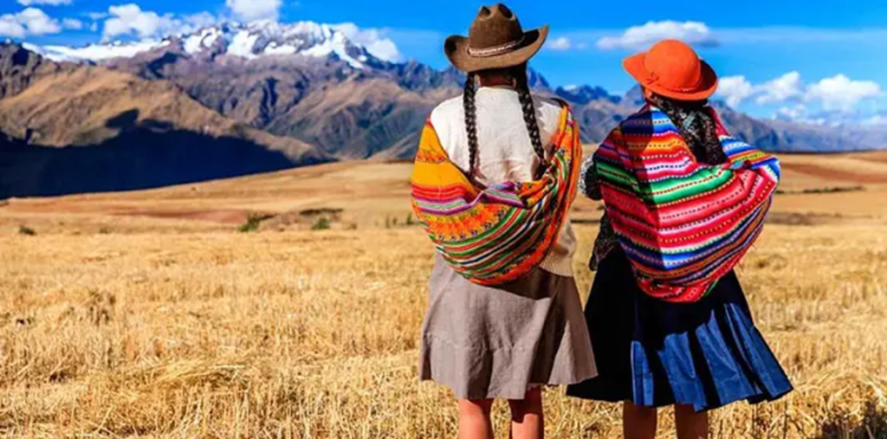

# Le Perou - Education et Sante

> Source originale : [https://www.perouamitiesolidarite.org/education-sante/](https://www.perouamitiesolidarite.org/education-sante/)

---

L’ éducation au Pérou relève de la compétence du ministère de l’éducation,  chargé de formuler, de mettre en œuvre et de surveiller la politique nationale en matière d’éducation. Selon la Constitution, l’enseignement initial, primaire et secondaire est obligatoire. Dans les établissements publics, l’éducation est gratuite. Les universités publiques garantissent le droit à l’enseignement gratuit aux étudiants ayant des résultats scolaires satisfaisants, sans être conditionné au niveau socio-économique de l’étudiant. En 1996, le gouvernement péruvien avait mis en place des réformes de l’enseignement qui étendaient l’enseignement obligatoire et gratuit à tous les élèves âgés de 5 à 16 ans, appelées educación básica (enseignement primaire) et educacion técnica (enseignement technique). Depuis lors, le taux d’alphabétisation a augmenté mais pas à la hauteur des attentes.    Un décret ministériel de 2008 a également imposé aux écoles publiques et privées de suivre les mêmes directives en matière de programme d’études national,  définies à l’époque et supervisées  par les autorités éducatives locales. L’année scolaire commence au début du mois de mars et se termine en novembre / décembre. L’espagnol est la langue utilisée dans les écoles, bien que dans certaines écoles primaires régionales, l’aymara ou le quechua (également langue officielle au Pérou) sont la langue d’enseignement et l’espagnol est proposé alors comme seconde langue.

L’éducation est obligatoire à partir de cinq ans. Ayant achevé l’enseignement primaire à l’âge de onze ans, les enfants entrent ensuite dans l’enseignement secondaire.

Voici un aperçu de tous les niveaux :

- L’éducation pré-scolaire ( educación inicial )  pour les enfants de 3 à 5 ans (1 589 013 enfants y sont inscrits selon les données de l’Unesco pour 2019).
- L’école primaire ( educación primaria ) pour les enfants de 6 à 11 ans (3 175 399  inscrits en 2019)
- L’école secondaire ( educación secundaria) pour les jeunes de 12 à 16 ans (2 601 721 inscrits en 2019)
- L’enseignement  supérieur pour les jeunes de 17 à 21 ans. (2 557 060 inscrits en 2019).

La scolarité est gratuite pour tous les enfants âgés de 6 à 16 ans. Cependant, elle est inaccessible à de nombreux enfants des zones rurales.

Au Pérou, la population des 0-14 ans représente 25% du total du pays

Enseignement primaire

Pendant cette période, les élèves acquièrent des connaissances générales dans des domaines tels que les sciences, les mathématiques et la langue. L’élève doit obtenir un score minimum de 11 points (sur 20) pour réussir les tests de langue et de mathématiques.

Enseignement secondaire

L’école secondaire au Pérou est divisée en deux cycles :

- Premier cycle – Général pour tous les étudiants. Il dure deux ans et constitue l’essentiel de l’enseignement obligatoire.
- Deuxième cycle – Un cursus diversifié, scientifique, humaniste avec des options techniques. Il dure trois ans.

Pourtant, la réalité est bien différente de cette déclaration d’intention : 8 millions d’enfants rêvent d’obtenir un diplôme, cependant la plupart ne pourra pas accomplir ses rêves.  D’après l’Unesco en 2018 le nombre d’analphabètes était de 51,730 jeunes entre 15 et 24 ans, dont 46% étaient des hommes contre 54% de  femmes. Chez les femmes la situation est plus grave dans les Andes, où le nombre d’enfants par famille est plus important.   Pour ce qui est de la population au-dessus de 15 ans le nombre d’analphabètes est de 1 334 124 dont 25% des hommes et 75% des femmes.Comme pour le secteur de la santé, le clivage entre école urbaine et école rurale est flagrant.                              Ce sont les problèmes intrinsèques à la vie en campagne : les centres éducatifs sont souvent très éloignés du lieu de vie des enfants (plusieurs heures de marche par jour sont souvent nécessaires) ; la réalité des enfants dans les campagnes est très différente de celle des villes (ils doivent obligatoirement participer aux tâches familiales, emmener les bêtes au pâturage, couper du bois, filer la laine, tricoter, etc.) De plus, l’éducation interculturelle-bilingue est plus un vœu pieux qu’une réalité (ce qui limite les possibilités d’apprentissage des enfants des peuples autochtones) et il n’y a souvent qu’un professeur pour tous les niveaux. Le caractère obligatoire de l’éducation est donc fortement limité par la situation géographique.                                                                                                     De plus, le caractère gratuit est lui aussi à relativiser. Officiellement, l’école est gratuite, et l’inscription n’est conditionnée à aucun paiement. Cependant, l’obligation d’acheter des livres scolaires neufs ainsi qu’un uniforme est une réalité dans un grand nombre d’établissements même publics, bien que son obligation soit interdite par la loi. Pour ces motifs, un certain nombre de familles péruviennes n’envoie pas leurs enfants à l’école, par manque de moyens économiques.  C’est dans les zones rurales que l’on constate le plus fort taux de malnutrition. 1 enfant sur 4 arrive à l’école avec des problèmes de malnutrition. Dans certains villages des Andes, le taux de malnutrition atteint 50%. Il est prouvé au niveau médical que la malnutrition et le manque de stimulation dans les trois premières années de vie de l’enfant ont des incidences sur sa capacité d’apprentissage.

Dans les classes sociales désavantagées, la population féminine est la plus touchée. Le pourcentage de la présence des femmes dans l’éducation secondaire en 2019 était de 90,5 contre 95,1 pour les hommes selon les données de l’Unesco.  L’éducation des filles n’est pas prioritaire par rapport à celle des garçons lorsque la famille n’a pas les moyens d’envoyer tous ses enfants à l’école. L’autre grande barrière à l’éducation des filles est le problème des grossesses adolescentes qui poussent les jeunes filles de 14 à 17 ans à abandonner l’école secondaire. Le manque d’accès à l ‘éducation sexuelle oblige les jeunes filles à chercher coûte que coûte un travail qui puisse leur permettre de vivre décemment avec leur enfant, les empêchant par là même de finir leur éducation secondaire.                                                                           L’exode rural a favorisé l’envoi des enfants à l’école (plus accessible en ville que dans les campagnes). En arrivant en ville, les enfants sont à la charge d’un parent, d’un ami, d’une connaissance du village, et rentrent lorsqu’ils le peuvent, retrouver leurs familles pendant les grandes vacances.                                                                                                       Quant à la déscolarisation, d’après l’Unesco, 47 585 enfants se trouvaient dans cette situation en 2018, contre 21 164 en 2011.  Quant aux adolescents, il y en avait 28 217 déscolarisés en 2018 contre 55 853 en 2011.   Ici, l’amélioration est nette.                                                         90% des établissements publics pratiquent les classes à différents niveaux et cela jusqu’à la quatrième année de primaire sous la direction d’un seul professeur.  10% des professeurs n’ont pas de formation académique et 15% ont une formation différente de l’enseignement.                                                                                                                  Le Pérou est l’un des pays d’Amérique du Sud où l’État accorde le moins de moyens financiers à son système éducatif. En 2015 par exemple seulement 3,97% du PIB étaient consacrés à l’éducation. En 2019 ce pourcentage avait encore diminué à 3,85%.  La dépense annuelle par élève et par an en école primaire était en 2019 de 1 470 contre 1 453 en 2015.  Le montant est resté pratiquement inchangé.

Malgré les difficultés mentionnées, la croissance économique que connaît le Pérou depuis 10 ans n’a pas amené l’État à investir pour améliorer et rendre plus accessible l’éducation à toute la population. Ce secteur continue à être l’un des plus inégalitaire et élitiste parmi les pays d’Amérique Latine.

L’éducation est fondamentale pour changer notre réalité économique, sociale et morale.

Dans le cadre de la pandémie Covid 19 le gouvernement a mis en place avec l’aide du secteur privé le programme « APRENDO EN CASA » conçu par une équipe d’experts en éducation. Il a été diffusé par la télévision, la radio et via internet.  Il a pour objectif d’éviter l’interruption de l’enseignement et la perte de l’année scolaire aux 8 millions d’étudiants péruviens.  Il s’est avéré nécessaire de travailler davantage sur des supports digitaux dans le cadre d’une logique pédagogique qui ne se limite pas à l’information.  Dans le cadre du programme MINEDU « un ordinateur par enfant » 600 000 laptops ont été distribués aux étudiants des différentes zones du Pérou. Les gouvernements locaux se sont engagés à financer l’installation de panneaux solaires afin d’approvisionner en énergie.

## LE SYSTÈME DE SANTÉ

Le système de santé péruvien est divisé en deux secteurs : le secteur public et le secteur privé. Les hôpitaux, les polycliniques et les centres de santé opèrent sous l’égide du ministère de la Santé et de la Sécurité sociale. Le secteur privé comprend les hôpitaux et les cliniques gérés par de nombreux prestataires de santé, notamment les cabinets médicaux, les cliniques, les pharmacies et les laboratoires. Les consultations sont payantes aussi bien dans les hôpitaux publics que privés.

Une des barrières à l’accès à la médecine « officielle » est le gouffre culturel qui existe entre le médecin en blouse blanche et le malade vivant en campagne. D’abord, ce dernier ne parle que le quechua, ce qui limite grandement la qualité du service médical offert. Ensuite, il a une autre conception de l’hygiène et de la médecine. L’interculturalité est un sujet de débat et de réforme permanente pour le Ministère de la Santé.  En outre, la santé sexuelle est très préoccupante au Pérou. Le taux de mortalité en couche est l’un des plus importants sur le continent, selon un rapport d’Amnesty International. L’avortement étant illégal sauf en cas de danger de mort pour la mère, les avortements clandestins coûtent régulièrement la vie à beaucoup de jeunes filles. Or, en l’absence d’une éducation sexuelle appropriée (éducation excessivement religieuse et/ou isolement géographique qui génère une désinformation inquiétante), la seule solution est l’avortement clandestin ou alors de mener la grossesse adolescente à terme. Ce filles-mères entrent alors dans un cercle vicieux de pauvreté (elles doivent travailler et s’occuper d’un bébé à 15 ans) où l’accès à la santé est encore plus limité, pour elle comme pour leur enfant.

Comme dans de nombreux pays d’Amérique latine, le Pérou fournit des services de santé de qualité. C’est dans les grandes villes que l’on trouve des soins de meilleure qualité, les installations étant limitées dans les régions éloignées. Le coût des soins est également prohibitif pour les Péruviens au bas salaire, les services de santé fournis par les centres de santé publics et privés étant généralement très coûteux. Pour endiguer ce phénomène, la souscription à un régime d’assurance maladie, outre la sécurité sociale, est obligatoire pour tous les travailleurs au Pérou. Comme dans beaucoup d’autres domaines, le clivage ville/campagne, ainsi que littoral/reste du Pérou est criant. En termes de chiffres, l’espérance de vie varie entre 61 ans en moyenne dans la région de Huancavelica (une des régions les plus pauvres du pays, située dans les Andes) et 79 ans dans la ville de Lima. De même, la mortalité infantile passe de moins de 20 pour mille dans la capitale à plus de 80 pour mille dans certaines provinces. La dénutrition chronique est un problème grave en zone rurale et elle touche presque 50% des enfants de moins de 5 ans. Un problème fondamental des régions isolées du Pérou est la santé environnementale et le manque, par exemple, d’accès à l’eau potable et à un assainissement des eaux usées : dans les régions andines, jusqu’à 50% des communautés ne sont pas reliées à ces services d’hygiène de base. Ce problème se retrouve également dans de nombreux quartiers « jeunes » de grandes villes comme Lima, où les bidonvilles, lieux d’urbanisation sauvage, sont complètement oubliés par l’État. Les inégalités sont frappantes.

L’accès à une couverture sociale est actuellement en pleine expansion. Depuis la création du SIS (Seguro Integral de Salud, en français Assurance Maladie Intégrale), l’accès gratuit aux services médicaux de base est accessible à un nombre grandissant de personnes, avec pour seule exigence la présentation de la carte d’identité. L’autre établissement public relativement accessible est Essalud, auquel est automatiquement affiliée toute personne qui a un contrat de travail. Si cela ne règle pas les problèmes de disponibilité de personnel, de matériel (surtout dans les campagnes), et que le travail illégal (sans contrat) limite son utilisation, et qu’il ne couvre largement pas tous les aspects de la santé des Péruviens, ces établissements de sécurité sociale et d’attention au public sont tout de même une avancée notoire. Les pharmacies locales sont également très répandues et fournissent la plupart des types de médicaments disponibles sur le marché international. Avec peu de réglementation, il est souvent facile d’obtenir un médicament sans ordonnance, bien qu’il soit toujours conseillé de consulter son médecin au préalable. Il est indispensable de rechercher le nom générique, sans marque, du traitement dont on a besoin.

La Sécurité Sociale au Pérou Au Pérou, on peut choisir entre deux types d’assurances sociales : – Seguro Integral de Salud (SIS), mandaté par le Ministère de la Santé et visant à protéger les communautés à faible revenu sans assurance maladie, – EsSalud, une forme d’assurance maladie financée par les employeurs, qui cotisent à hauteur de 9 % du salaire des employés.     EsSalud est obligatoire pour les travailleurs des secteurs public et privé, pour les retraités et leurs descendants mineurs (de moins de 18 ans), pour les travailleurs indépendants et pour les étudiants. Ce programme offre une couverture pour les soins dentaires, la maternité, les soins de santé généraux et spécialisés, les frais d’hospitalisation, les analyses de laboratoire, les médicaments, la rééducation, la prévention et la vaccination, etc.  Dans le cas où des membres EsSalud (travailleurs indépendants, étudiants, ouvriers agricoles ou chauffeurs de taxi) contribuent au SIS, l’assurance volontaire, le plafond de couverture dépendra de la prime souscrite.

Assurance santé au Pérou Au Pérou, les employeurs sont tenus de s’acquitter de toutes les formalités liées aux cotisations de leurs employés, y compris les cotisations sociales. Par conséquent, tout nouvel employé doit être inscrit à la sécurité sociale .

