# Le Perou - Geographie Climat et Ressources

> Source originale : [https://www.perouamitiesolidarite.org/geographie-climat-et-ressources/](https://www.perouamitiesolidarite.org/geographie-climat-et-ressources/)

---

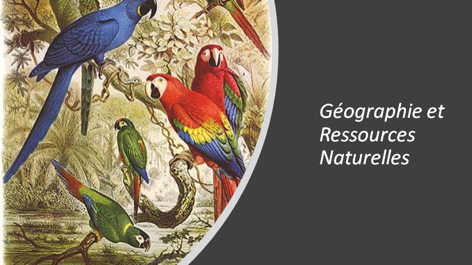

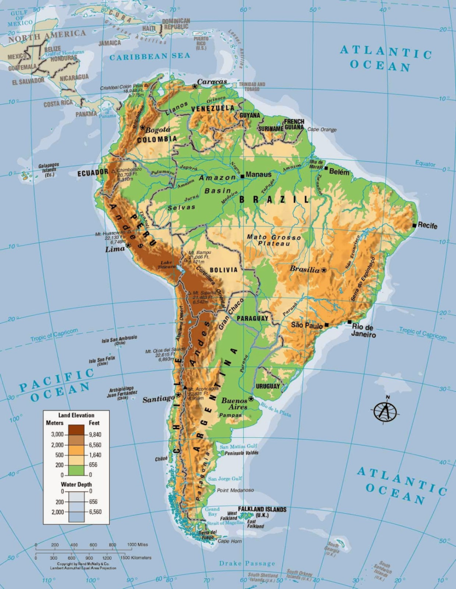

Tout le continent américain est traversé du nord au sud par une chaîne de montagnes située à l’ouest et parallèle au littoral du Pacifique. En Amérique du Sud, elle prend le nom de Cordillère des Andes.

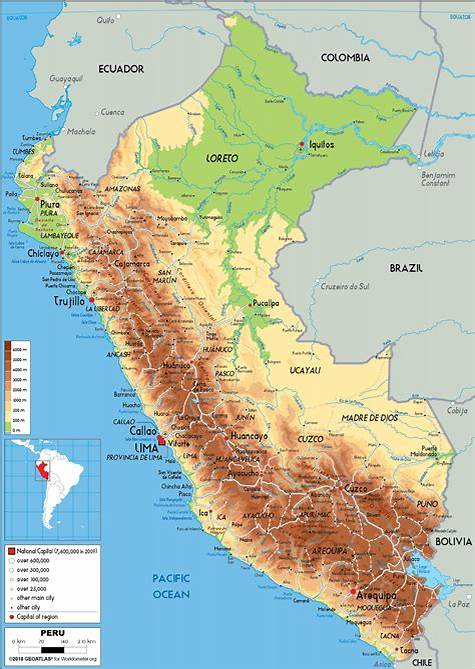

La cordillère des Andes façonne la réalité quotidienne du Pérou. Elle est à l’origine de sa géographie si particulière, de sa richesse et en même temps de l’isolement de certaines villes nichées dans les Andes et dans l’Amazonie. En effet, se déplacer transversalement entre les différentes villes du pays est particulièrement difficile vu l’état des routes ou le manque de voies de pénétration vers la montagne et l’Amazonie. La qualité du service public et la modernité ont du mal à atteindre les villes les plus éloignées. Ceci entraine une forte émigration vers la capitale et les grandes villes du littoral.

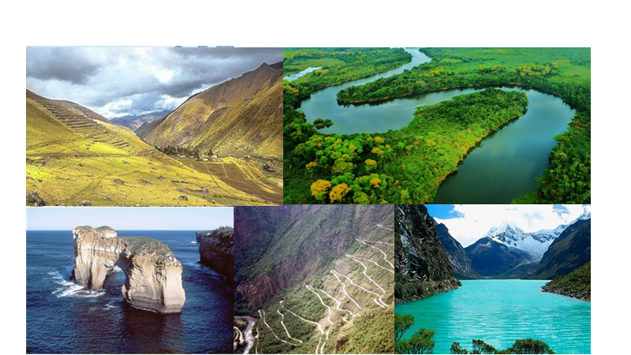

Pour mieux comprendre la géographie du Pérou, il faut noter qu’il existe différentes régions et écosystèmes. On dénombre 8 régions naturelles mais pour simplifier nous parlerons des trois régions traditionnelles, clairement différenciées : le littoral, la montagne (les Andes) et l’Amazonie.

### Saviez-vous que ….?

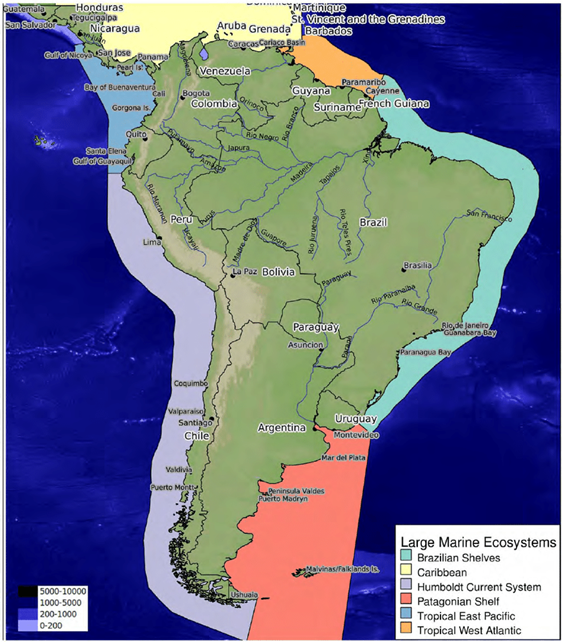

Le courant océanique Humboldt (en gris), se déplaçant sud-nord, donc froid, sur tout le littoral péruvien apporte du plancton et une extraordinaire faune marine

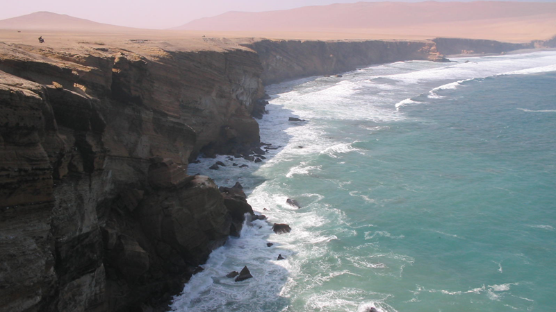

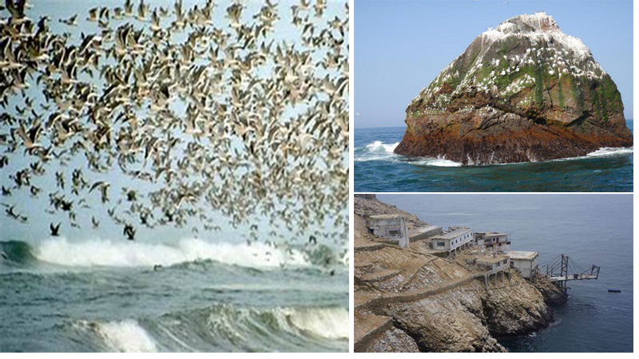

Entre la cordillère des Andes et l’Océan Pacifique se trouve un long corridor de terre désertique. Ce phénomène s’explique par l’influence du courant d’Humboldt, courant froid qui longe le littoral du sud au nord.  Les Andes environnantes, agissent comme une barrière naturelle, formant une couche semi-permanente de nuages extrêmement dense à basse altitude empêchant le passage du rayonnement solaire direct et par conséquent, la formation des nuages générant la pluie.

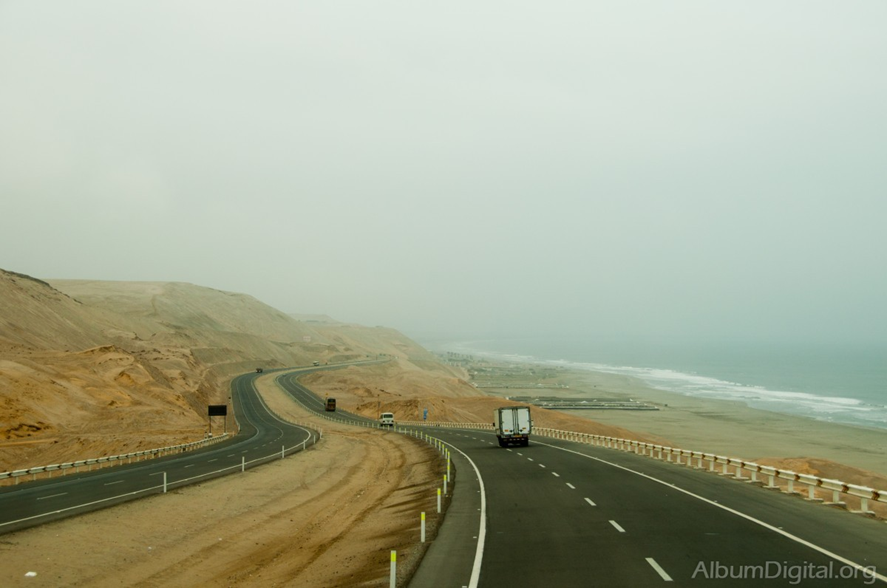

» La Panamericana » constitue le réseau routier le plus long du monde. Elle longe la côte Ouest du continent américain, de l’Alaska à la Patagonie. Elle mesure aux environs de 30 000 Km. Une route étrange, entre désert minéral et océan Pacifique….

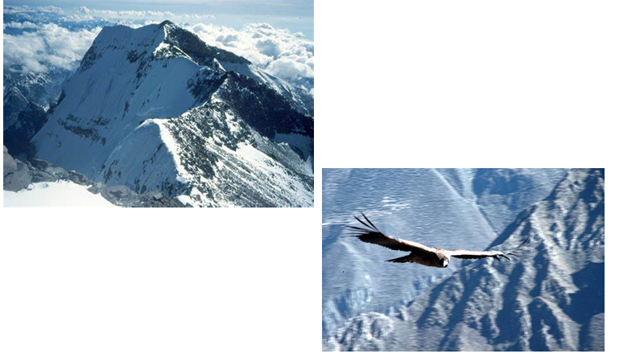

### Saviez-vous que…. ?

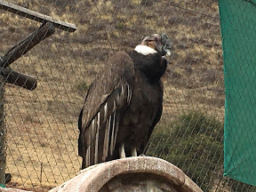

Le Condor des Andes est une espèce d’oiseaux de proie diurnes de l’ordre des Accipitriformes. Il est parfois appelé Grand Condor des Andes, du fait de sa taille. Appartenant à la famille des Cathartidae, ce rapace charognard est la seule espèce du genre Vultur. Il vit en Amérique du Sud, tout le long de la Cordillère des Andes et des côtes du Pacifique. Par son envergure de 3 m à 3,20 mètres en moyenne, parfois plus de 3,20 m et jusqu’à 3,50 m au maximum, il est le plus grand rapace et le plus grand oiseau volant terrestre du monde

53 cours d’eau de débit permanent descendent des glaciers des Andes créant ainsi des vallées fertiles où se situent les principales villes côtières et les zones agricoles.  Ceux qui descendent des glaciers vers l’est sont à l’origine des principaux confluents du grand fleuve Amazone, qui traverse des plaines sur tout le continent sud-américain pour déverser ses eaux dans l’Océan Atlantique.

## La Faune ….

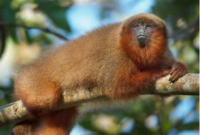

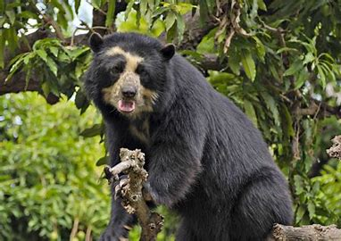

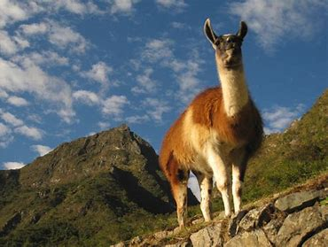

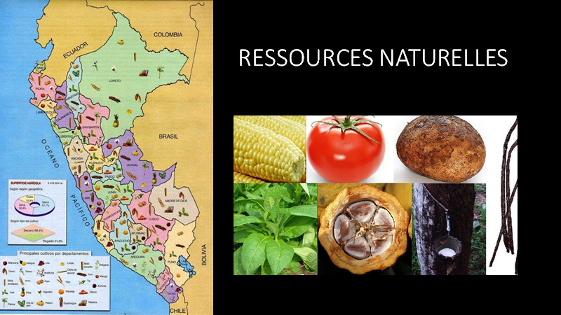

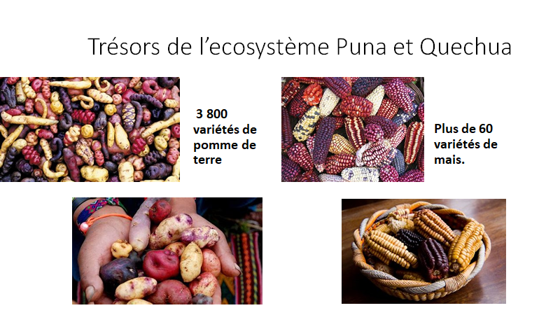

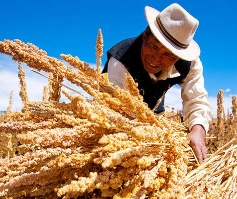

## Quelques plantes médicinales

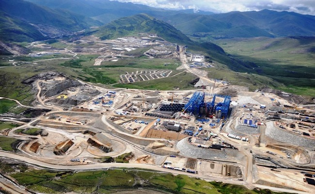
