# Le Perou - Patrimoine Culturel

> Source originale : [https://www.perouamitiesolidarite.org/patrimoine-culturel/](https://www.perouamitiesolidarite.org/patrimoine-culturel/)

---

Chavin de Huantar  (Site Archéologique)

La culture Chavín se développa sur les hauts plateaux andins entre 1500 et 300 av. J.-C. Le site connu de nos jours sous le nom de Chavín de Huántar en était le centre. Le site est composé d’un complexe de terrasses et de squares en pierre. Les Chavíns auraient principalement été une société religieuse qui devrait son influence à sa culture plutôt qu’à une expansion agressive.

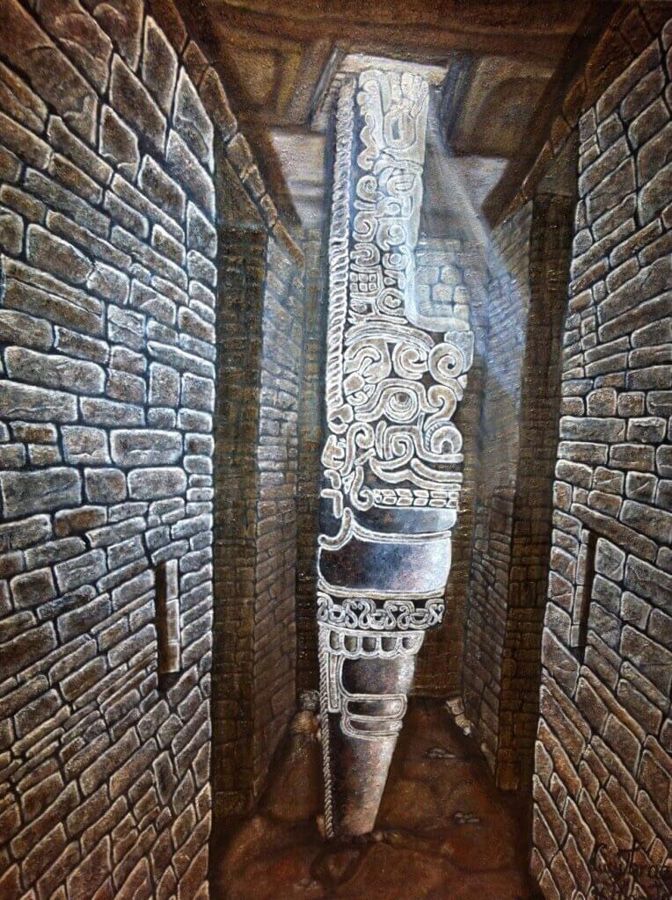

Zone Archéologique de Chan Chan (La Libertad)

La ville de Chan Chan fut la capitale de la culture Chimú . Le royaume Chimú se développa le long de la côte Nord du Pérou entre le IXème et le  XVème siècle. Chan Chan est divisée en neuf complexes fortifiés entourés de murs distincts et comprenant des salles de cérémonie, des chambres mortuaires, des temples, des réservoirs et des résidences. Les Chimú furent vaincus par les Incas en 1470. Le site fut classé en péril quand il fut inscrit au patrimoine mondial car les constructions en adobe sont facilement endommagées par les fortes pluies et l’érosion.

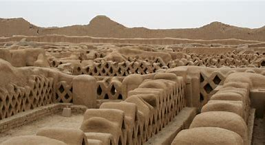

Parc National du Huascaran (Ancash)

Le parc national de Huascarán est situé dans la cordillère Blanche dans les Andes . Il est situé autour du Huascarán , le plus haut sommet du Pérou. Il abrite des glaciers , des ravins et des lacs . Le parc accueille plusieurs espèces animales régionales.

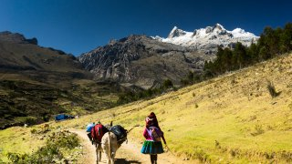

Ville de Cuzco

Cuzco se développa durant le règne de l’Inca Pachacutec qui dirigeait le royaume de Cuzco au XVème siècle lorsqu’il devint l’ empire inca . La ville devint la plus importante de l’empire inca. Elle était divisée en zones séparées pour les activités religieuses et administratives qui étaient entourées de zones dédiées à l’agriculture, à l’artisanat et à l’industrie. Après avoir conquis l’empire inca au XVIème siècle , les Espagnols construisirent des églises baroques et des bâtiments sur les ruines incas.

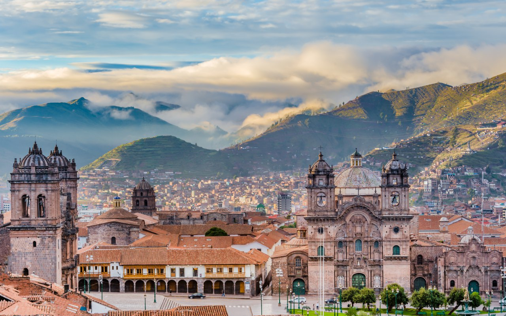

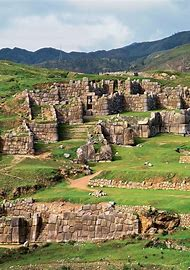

Sanctuaire Historique de Macchu Picchu (Cuzco)

Situé à 2 340 m d’altitude, le site du Macchu Picchu était un grand domaine de montagne construit vers le milieu du XVème siècle et abandonné approximativement 100 ans plus tard. Il est constitué de murs, de terrasses et de bâtiments en pierre. La cité accueillait environ 1 200 personnes, principalement des prêtres, des femmes et des enfants. Elle fut laissée à l’abandon avant l’arrivée des Espagnols à Cuzco, probablement à cause de la variole .

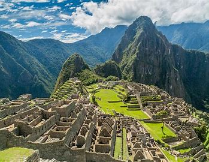

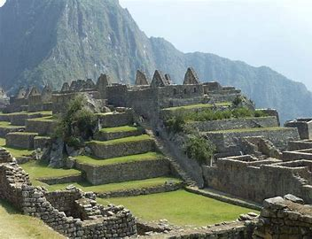

Les Lignes de Nazca (Ica)

Ces grandes figures situées dans le désert de Nazca dateraient de  la culture Nazca entre 400 et 650. Les lignes qui composent ces figures furent créées en enlevant des cailloux rougeâtres du sol et en laissant ainsi apparaître le sol blanchâtre. Les figures représentent notamment des animaux parmi lesquels un singe et un colibri , des plantes et des formes géographiques. Elles auraient servi des buts rituels.

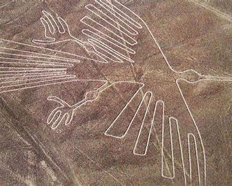

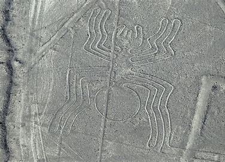

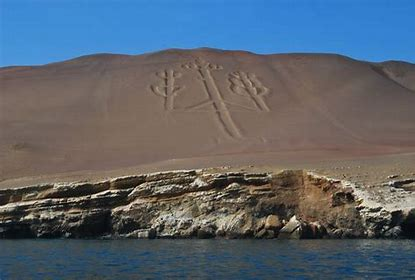

La Ville de Lima

Lima fut fondée en 1535 par Francisco Pizarro sous le nom de La Ciudad de los Reyes (Cité des Rois). Jusqu’au milieu de XVIIIème siècle , c’était la ville la plus importante de l’ Amérique du Sud espagnole . L’architecture et la décoration combinent le style de la population locale et le style européen, comme au monastère San Francisco qui seul était classé en 1988, avant que la zone classée soit étendue en 1991.

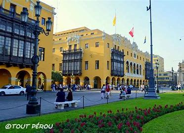

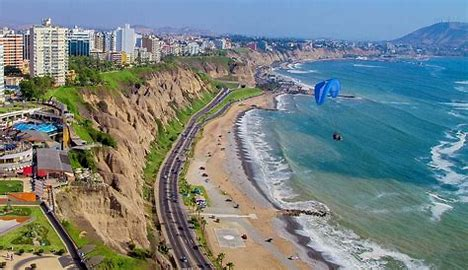

Centre Historique d’Arequipa (Arequipa)

Arequipa est construite principalement en sillar , une roche volcanique blanche produite par le volcan El Misti tout proche. L’architecture de la ville est connue pour combiner les styles traditionnels indigènes avec les nouvelles techniques importées par les colons européens.

et Le Canyon del Colca

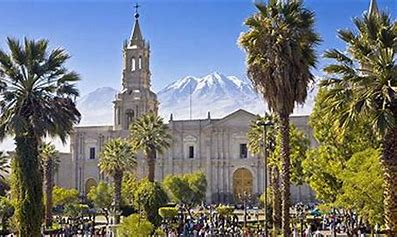

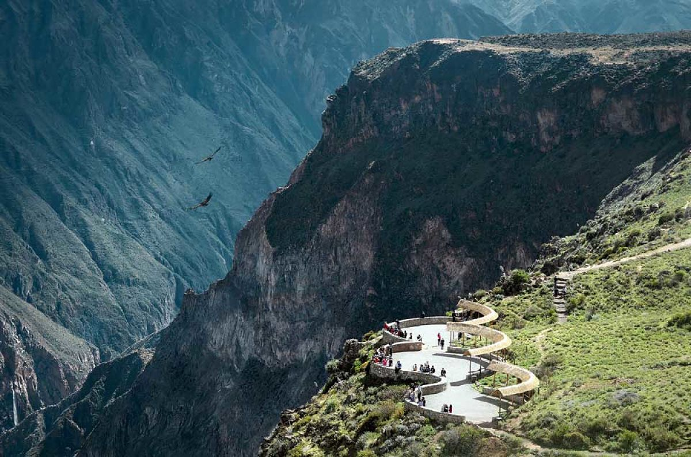

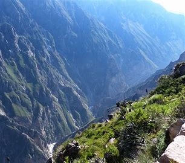

Parc National de Manu (Madre de Dios)

Le parc s’étend sur 17 162,95 km 2 et de 150 m à 4 200 m d’altitude. Le parc abrite 1 000 espèces d’oiseaux, plus de 200 espèces de mammifères (dont 100 espèces de chauves-souris ) et plus de 15 000 espèces de plantes à fleurs . Avant d’être inscrit au patrimoine mondial en 1987, le site avait été classé réserve de biosphère en 1977.

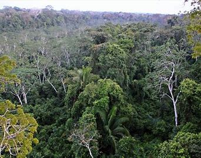

Le Lac Titicaca (Puno)

Le Lac Titicaca, situé dans la Cordillère des Andes, est traversé par la frontière entre la Bolivie et le Pérou. Il est aussi considéré comme le plus haut lac navigable du monde (altitude : 3 812 m), mais ce n’est rigoureusement exact que si on limite cette acception aux navires commerciaux de grande taille. C’est par ce lac qu’est née la culture  aymara avant la colonisation et la christianisation. Il existe une légende en relation avec ce lac : le premier dieu Viracocha a surgi de ce lac et a créé le monde ainsi que toutes les civilisations des Andes.

Parc National du Fleuve Abiseo  (San Martin)

Inscrit sur la liste du Patrimoine Mondial en 1990. Situé dans les Andes orientales du Pérou, le parc se trouve à la confluence des fleuves Marañón et Huallaga, tous deux affluents du fleuve Amazone. Il existe dans cette zone un important vestige préhispanique qui occupe une surface de plus de 1500 Km2, à cheval sur la limite du parc. Depuis 1986 le parc du fleuve Abiseo n’est plus ouvert au public.

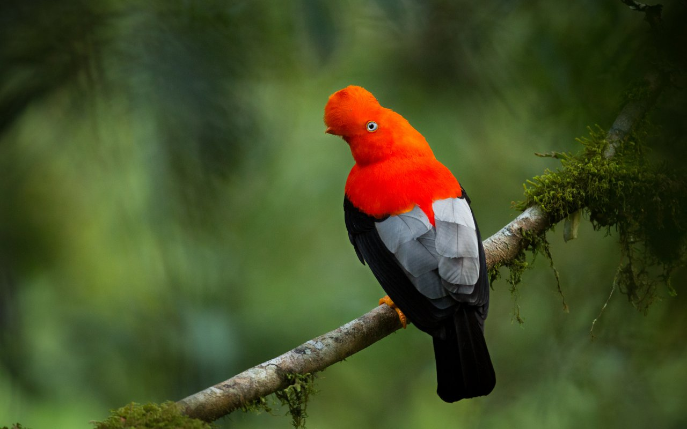

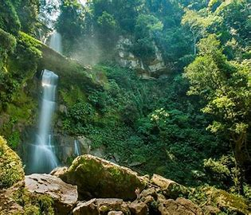

La Ville fortifiée de Kuelap  (Chachapoyas)

La plus belle illustration de la culture et de l’organisation politique et religieuse des Chachapoyas est sans conteste la cité fortifiée de Kuelap. Perchée à 3200m, sa position stratégique atteste des rivalités entre populations de l’époque (Xème siècle). L’ensemble architectural ainsi que les preuves de trépanation et de soins funéraires complexes attestent des nombreux savoirs que les Chachapoyas maîtrisaient déjà bien avant l’arrivée des Incas.

## La Gastronomie Péruvienne

La cuisine péruvienne est véritablement une composante essentielle de la culture nationale. Elle est le résultat de l’apport de toutes ces populations aux cultures très différentes qui sont arrivées dans des circonstances très diverses tout au long des siècles et depuis l’arrivée des Espagnols.  Il y a eu les Arabes du Levant espagnol et du Maghreb; la population noire venue de l’Afrique Occidentale et après l’indépendance, les Chinois de Canton et de Macao, les Japonais d’Okinawa, les Allemands et les Autrichiens du Tyrol; les Italiens de Ligurie, etc. Toutes ces différentes cultures ont donné au Pérou son identité métisse et la richesse de sa gastronomie. Reconnue  comme une des meilleures cuisines du monde, voici quelques pistes pour partir à la découverte d’un menu aussi varié que savoureux. La caractéristique majeure de la cuisine péruvienne est  la présence de l’aji, un piment apprécié pour son arôme et dont la sauce se décline sous diverses variantes mais elle est toujours piquante.  Le riz est présent à tous les repas (les Péruviens ne peuvent pas concevoir un repas sans riz) accompagné de tubercules (pommes de terre, yuca et autres). La viande est présente pratiquement dans tous les repas lorsque les ressources de la famille le permettent. Dans les villes du littoral on consomme surtout du poulet et du poisson. Au nord on préfère le cabri ou chevreau. Au sud et dans les Andes on apprécie le porc, le cochon d’Inde « cuy » et les grenouilles.  Tout dépend de la région et des ressources des familles.

Le Ceviche est un plat à base de poisson. Le principe est simple : prenez du poisson frais (ici l’équivalent est le maigre ou le bar très frais), coupez-le en petits dés, laissez-le cuire dans le jus de citron vert, ajoutez des lamelles d’oignons et de l’aji, ce piment local qui fait la particularité de la cuisine péruvienne, et servez très frais.

La Causa Rellena est un écrasé de pommes de terre, travaillé à la main avec du citron vert, de l’ huile d’olive et de la purée de piment jaune (aji). Cette masse est disposée en couches avec du thon, des oignons nouveaux, des avocats, des olives, des œufs durs, etc; le tout baigné d’une mayonnaise. Cette entrée est très appréciée et peut être servie avec différents ingrédients selon la saison. Le thon peut être remplacé par le poulet. C’est une entrée froide.

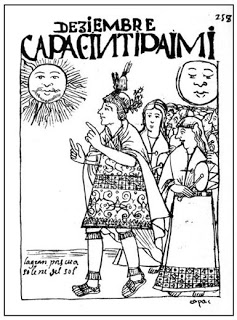

La papa rellena, littéralement ‘’pomme de terre fourrée’’, est une entrée où la purée de pommes de terre enrobe un fourrage fait de viande, de carottes, de petits pois, d’ œufs durs, de raisins secs, d’olives, que l’on frit. Ce même fourrage est utilisé dans le rocoto relleno : le rocoto est une forme d’aji plus grand, vert ou rouge, qui est dans ce cas fourré.

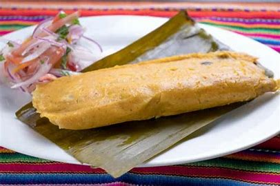

## PLATS PRINCIPAUX

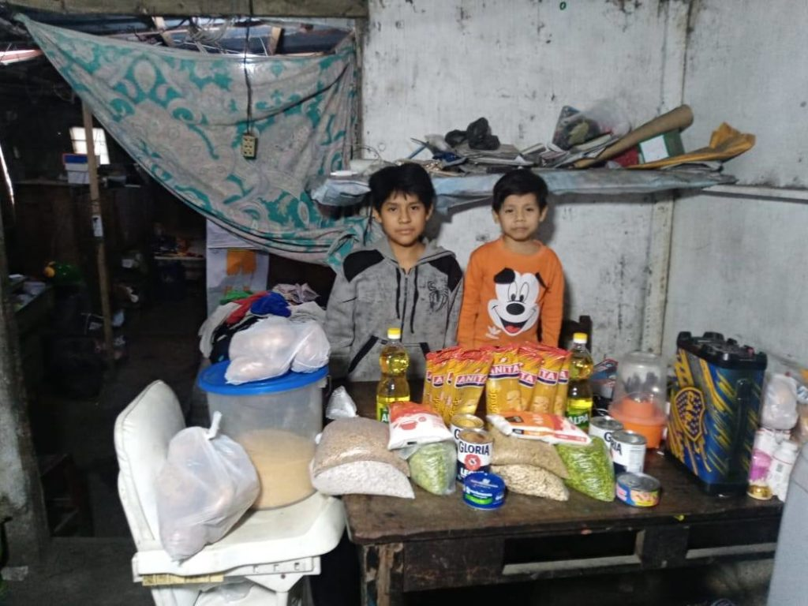

Le lomo saltado est un plat cuisiné dans un wok de style asiatique. C’est du filet de bœuf coupé en morceaux qui, macérés avec un peu de vinaigre, sont ensuite sautés dans le wok avec du aji en lamelles, des oignons et des tomates . Ce plat se mange accompagné de frites et de riz.

« El arroz con pollo » (riz-poulet) est un plat type paella car le riz cuit dans un mélange très assaisonné de poulet en morceaux et d’ épices .  La coriandre et le aji piment ,  jouent ici un rôle majeur. Il existe aussi el arroz con pato (riz-canard) ou le riz avec fruits de mer « arroz con mariscos »

Pour les amateurs de viande, le Pérou est le pays des merveilles, tant par la qualité de la viande que par la diversité des préparations. La grande surprise que le Pérou vous réserve est le cuy. Le cuy chactado d’Arequipa ou al horno de Cusco sont d’autres variantes. D’autre part, le chicharrón est un morceau  de viande de porc frit, grillé, servi avec du mote (mélange de maïs, de fèves…. bouillis) et des feuilles de menthe. Comme on dit, ‘’tout est bon dans le cochon’’ : même les tripes (la pansa), même l’estomac (le rachi, estomac de vache lavé, bouilli et frit)… Dans le poulet, les mollejitas sont une partie de l’appareil digestif de l’animal très recherchée. On en mange aussi les pattes, dans un plat appelé patita con mani (avec des cacahuètes). On en trouve partout dans le pays. De la même manière, les anticuchos se trouvent littéralement à tous les coins de rue : ce sont des brochettes de viandes (poulet, bœuf, et le plus typique : le cœur de bœuf) surmontées d’une pomme de terre, qui se mangent sur le pouce avec de l’ají. Et puis, un passage par le Pérou ne peut pas se concevoir sans goûter à la viande de lama… »el charqui »

Des Andes, on retiendra particulièrement tous les types de tubercules : en dehors de la pomme de terre, il y a l’olluco (oca), la yuca (sorte de manioc, souvent frit), le camote (patate douce) … Et les différentes préparations de ceux-ci : le chuño et la moraya sont des patates déshydratées, condensées, que l’on prépare souvent en soupe. Pendant la saison sèche, de mai/juin à octobre, on les prépare souvent en huatia o pachamanca : on construit un four de terre sèche à l’intérieur duquel on chauffe les pierres en allumant un feu. Quand les braises sont chaudes, on met les tubercules et/ou la viande, on fait s’effondrer le four au-dessus, et le tout cuit lentement, grâce aux pierres chaudes, récupérant le goût de la terre rouge des Andes. On trouve aussi quelques céréales typiques : le quinoa, le tarwi, la kiwicha (l’ amarante)… De la forêt amazonienne, le plus typique de la région est la préparation de tout ce qui dérive de la banane : soupe de banane, farine de banane, pancake de banane, gâteau de banane, banane frite… ainsi que tous les poissons d’eau douce : le zungaro, le paiche, etc.

## Les Desserts

Pour les gourmands qui ne peuvent pas se passer de sucre, les desserts péruviens sont assez riches et variés, le suspiro a la limeña (très sucré et surmonté de meringue),  les picarones, cette espèce de pâte de camote et de citrouille frite comme des beignets dans de l’huile bouillante et servie avec une espèce de miel de canne à sucre « chancaca »; la mazamorra morada, un flan épaissi à la maïzena faite à partir de maïs violet bouilli et d’épices comme la cannelle et le clou de girofle ;  le riz au lait (arroz con leche). Niveau pâtisserie, pas grand-chose à part l’alfajor, rond, fourré de manjarblanco (comme le dulce de leche, crème de lait bouillie sucrée). Le turrón de doña Pepe est aussi à mentionner.

Le ceviche et les boissons datent de l’époque des Moches et des Incas; les ragoûts et les soupes  rappellent l’ héritage espagnol; le riz et les « saltados » font partie de l’influence asiatique, alors que les desserts et les sucreries viennent des Maures arrivés avec  les conquistadors… « las empanadas » et « pastas » datent des Italiens …  En résumé, les plats sont très variés et il y en a pour tous les goûts. Voici une liste non exhaustive des principaux plats qui font la fierté des Péruviens: Antipode-peru.com

On utilise le même piment (Aji) pour la papa a la huancaina , entrée typique composée de morceaux de pommes de terre recouverts d’une sauce jaune faite à base de fromage frais et légèrement pimentée.  Vous trouverez les recettes ci après.

Toutes ces entrées peuvent aussi être consommées dans les marchés ou dans les rues comme piqueos, des snacks sur le pouce, comme le tamal, à base de farine de maïs ou autre, sucré ou salé, enrobé de feuilles de bananier ou de maïs selon la région…

Le Aji de gallina est un plat à base de morceaux de poulet baignés dans une sauce jaune plus ou moins piquante, à base d’aji amarillo, variante jaune et douce du même piment que celui du ceviche.

La carapulcra est un plat d’héritage africain. Son berceau est la ville de Chincha, (200 km au sud de Lima) région où habita la plupart des esclaves amenés de force pour travailler dans les champs de coton et de canne à sucre.  C’est une sorte de mélange juteux à base de patate sèche de couleur marron, de purée de cacahuètes et agrémenté de morceaux de viande de porc.

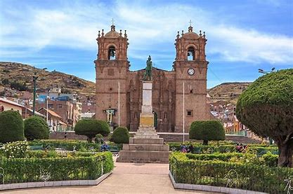

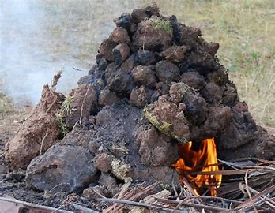

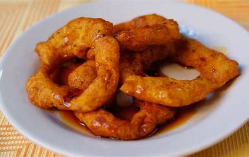

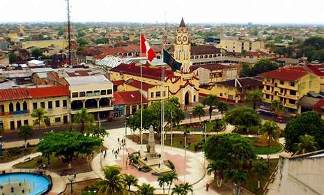

## BOISSONS

Quant aux boissons, le Pérou a de nombreuses variétés à vous faire découvrir. Pour commencer sans alcool, la chicha morada a pour beaucoup le goût du Pérou.

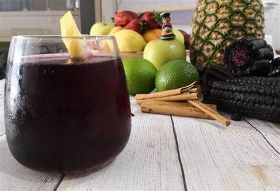

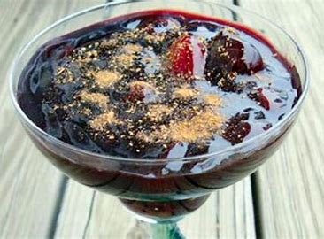

Comme la mazamorra, faite à base de maïs violet bouilli avec quelques autres fruits, de la cannelle et des clous de girofle, on en vend à tous les coins de rue.

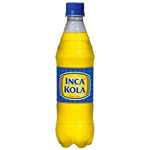

Puis, différentes infusions (mate) sont disponibles : de coca, d’anis, de camomille (manzanilla)…

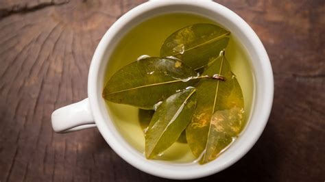

Pour finir, quelques boissons alcoolisées de réputation internationale:

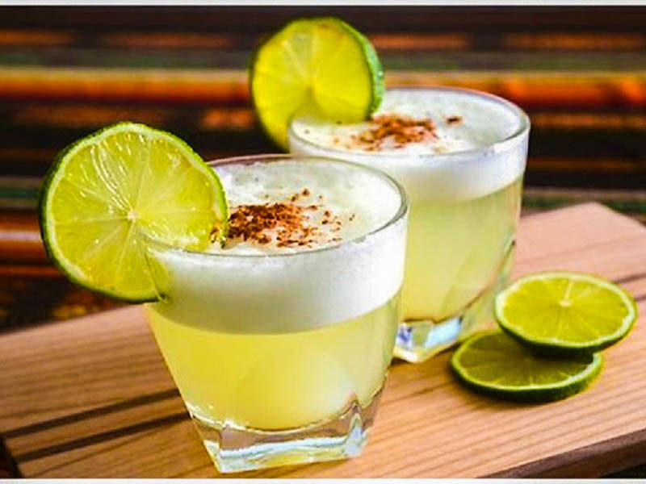

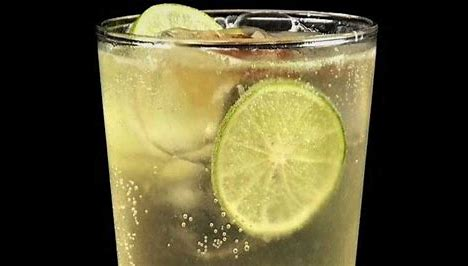
