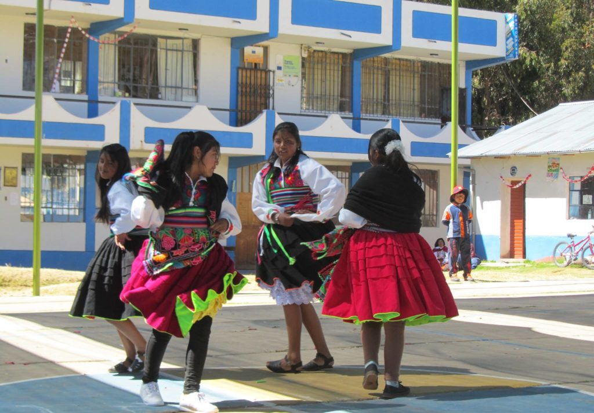
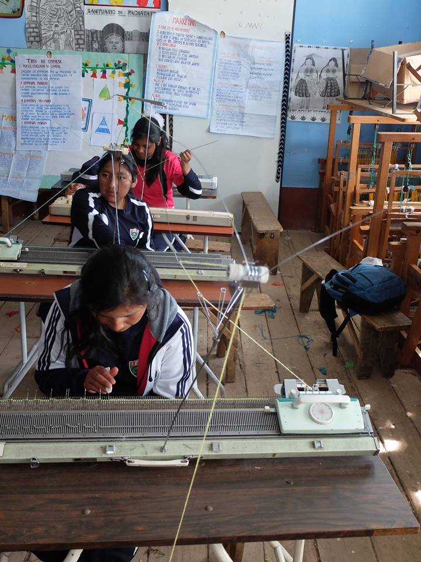
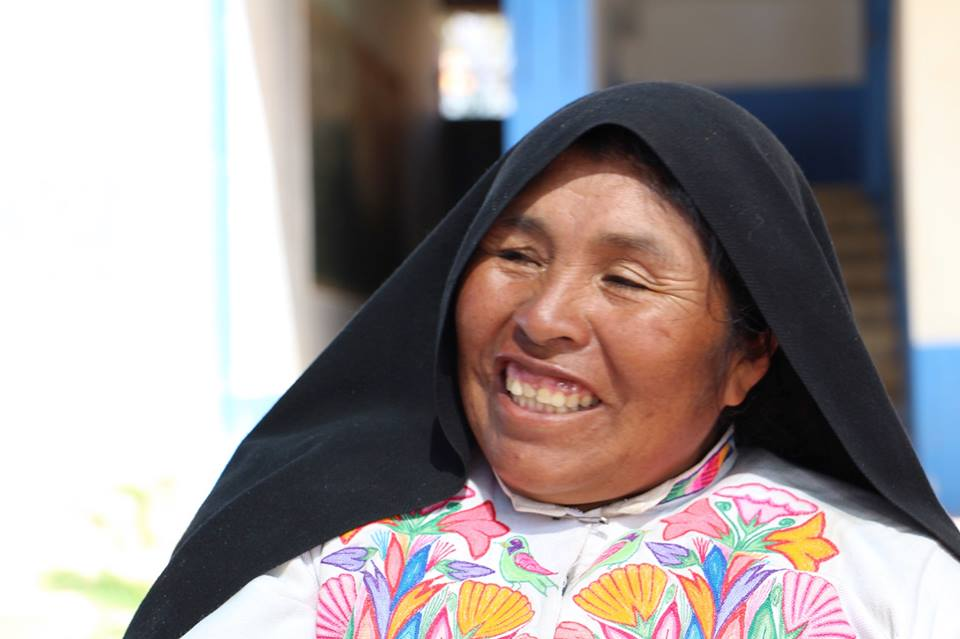
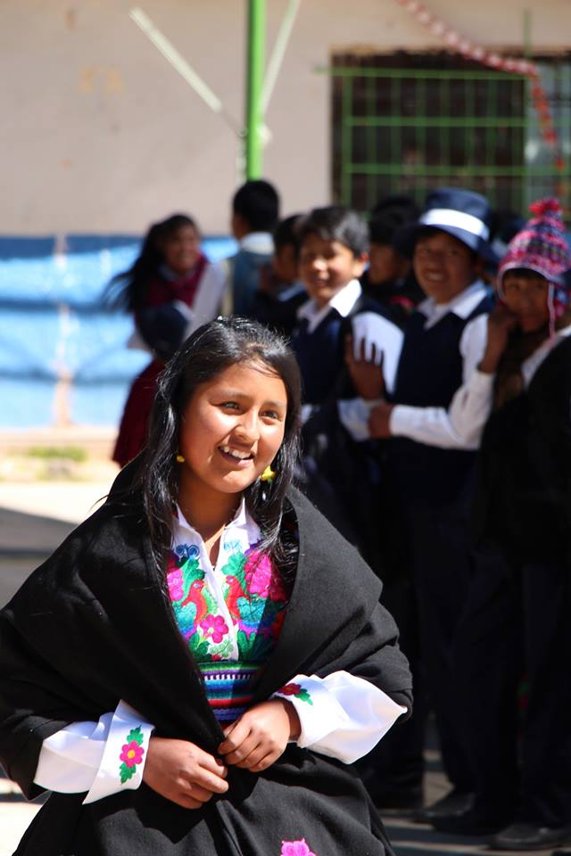
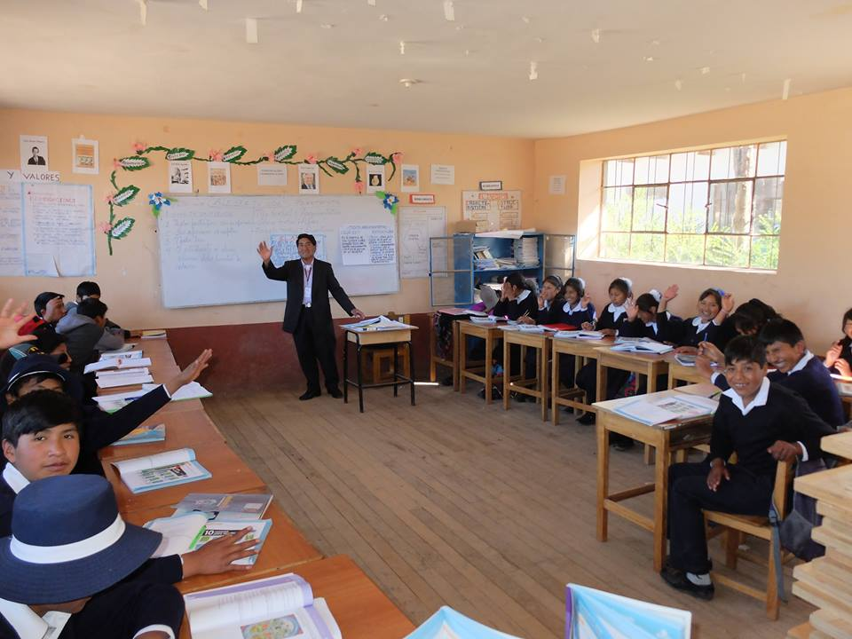
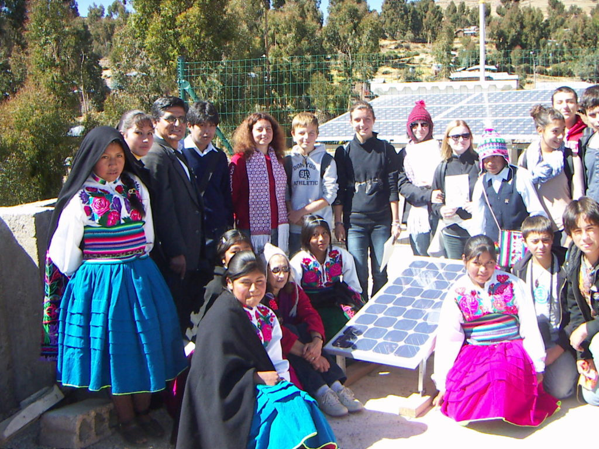
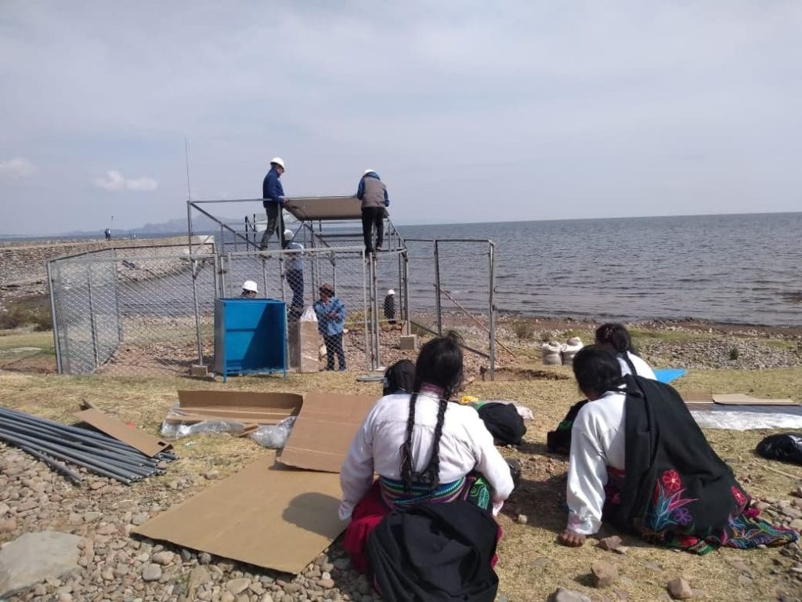
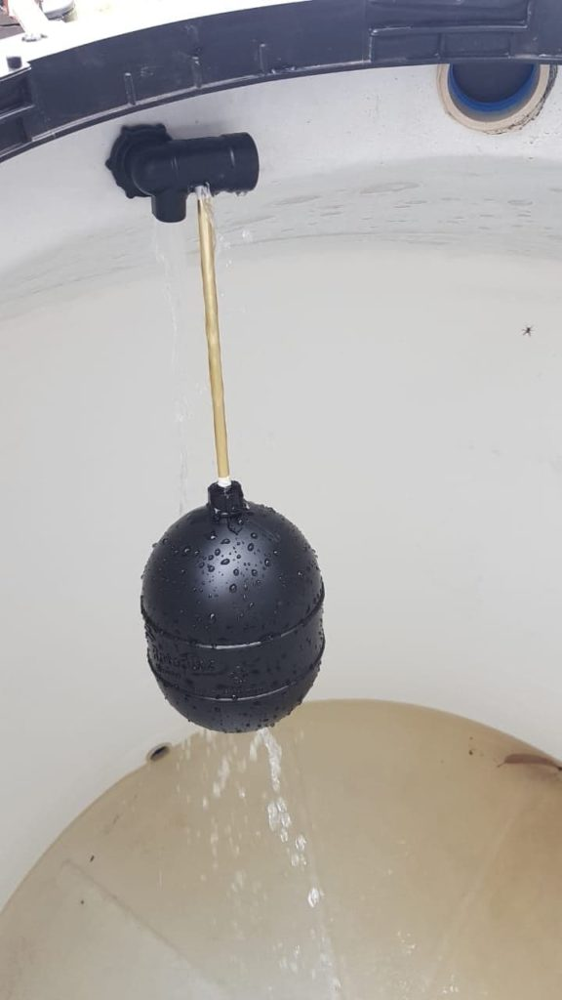
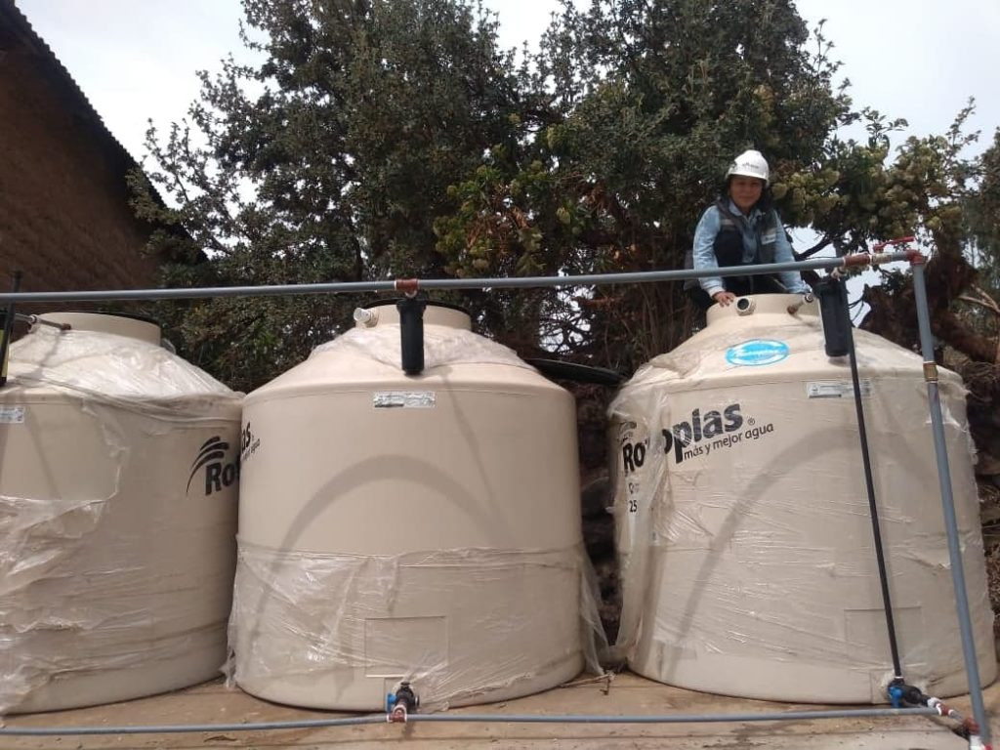

# Zone d'action - Amantani

> Source originale : [https://www.perouamitiesolidarite.org/amantani/](https://www.perouamitiesolidarite.org/amantani/)

---

## Notre action à AMANTANI

Historique :

En 2008, lors d’un voyage touristique, Françoise Choron et Nathalie Modet, membres de l’association, ont découvert l’île d’Amantani grâce à l’accueil exceptionnel des professeurs et des élèves du collège Miguel Grau. La surprise qui leur a été réservée a créé des liens très forts. Le collège Miguel Grau propose un atelier de tissage traditionnel sur métiers en bois ou machines électriques afin de transmettre le savoir-faire si précieux des habitants de l’île. Le principal du collège, Abel Villasante Fernandez, leur a offert une collation, et ses élèves ont  présenté des danses, des récitations et des musiques traditionnelles. Les discussions qui s’en sont suivies ont permis de prendre conscience des besoins du collège et ont amené l’association à s’ engager dans un soutien ponctuel tourné vers ces collégiens.

En 2011, Françoise Choron, enseignante au collège de Rauzan en Gironde, avec une quinzaine d’élèves a récolté des fonds pour financer un panneau solaire. L’été qui a suivi les élèves  ont pu rencontrer les jeunes d’Amantani. Moments inoubliables d’échanges : parties de football à 4000 mètres d’altitude, dégustation de produits français et de sopa de quinoa, démonstration de danses et de musiques traditionnelles et mimes de fables de La Fontaine. Le panneau solaire a été installé, des livres de littérature, une machine à tricoter et bien d’autres cadeaux ont été offerts . Pour la fête nationale, la délégation française a défilé en tant qu’invitée d’honneur.

- KONICA MINOLTA DIGITAL CAMERA

En 2017, des membres de Pérou Amitié Solidarité sont revenus à Amantani. Un nouveau directeur était en poste. L’échange s’est résumé à un partage de différents plats avec les parents d’élèves et les professeurs au sein du collège. L’association a exprimé le souhait de poursuivre l’ accompagnement et de les aider pour les financements de projets conséquents.

Très vite la demande d’avoir de l’eau a été formulée. Il n’y a pas d’eau courante à Amantani. Il faut aller puiser l’eau douce dans des puits. Pérou Amitié Solidarité a alors  réfléchi à un projet afin d’amener de l’eau potable au collège, au dispensaire et pour les familles environnantes en puisant l’eau dans le lac Titicaca. Projet réalisé en octobre 2019.   Ce fut une joie indescriptible pour les habitants et pour l’association. La fondation Pierre et Adrienne Sommer et Vision du monde ont été deux partenaires financiers très importants pour la réalisation de ce projet.

